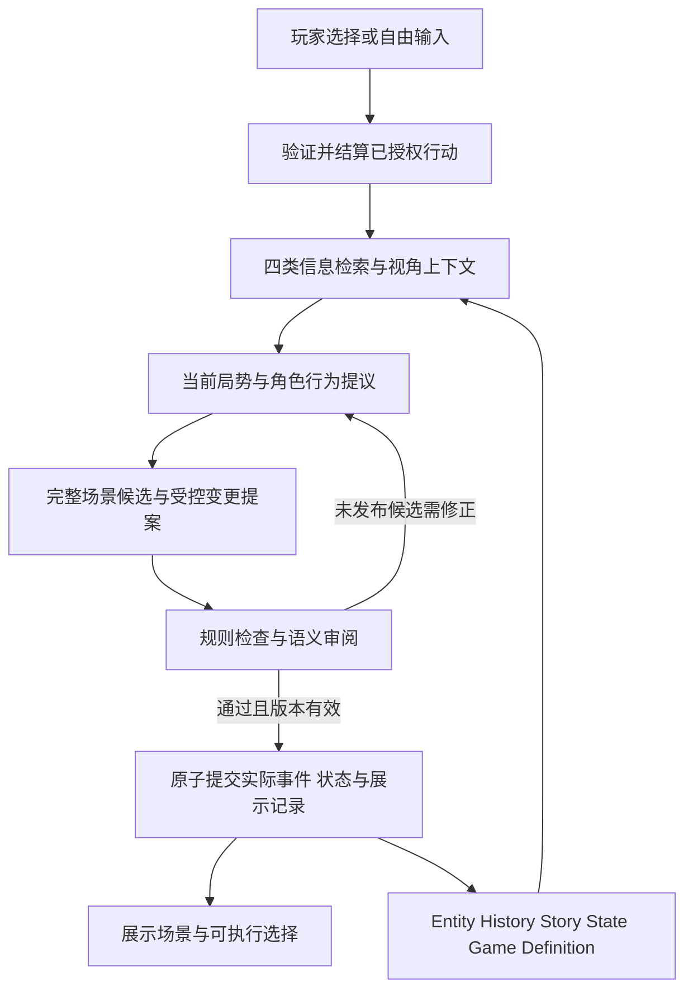

# 持续局势、完整场景与长期信息架构设计

## 1. 文档地位与实施入口

本文是待实施总 Spec，规定本次优化的目标、逻辑契约、分期边界及验收条件；不表示相关能力已经实现，不是逐文件执行 Plan。实施入口为 [P1 完整小故事 Plan](../plans/2026-09-12-narrative-architecture-p1.md)。

- 基准 main：`ca189eb12011d493f21bb50652fbfe1324387599`。
- 工作分支：`codex/narrative-architecture`；主仓内 worktree：`.worktrees/narrative-architecture/`。
- 历史对照：`staged-narrative-generation` 的 `3edcee4d`，只读保留。
- 现状、历史分数与失败证据唯一详述位置：[基准报告](../reports/2026-09-12-narrative-architecture-baseline.md)。

P1 Plan 按规则与历史闭环、真实生成接入、完整旅程验收三个里程碑展开 Task；执行状态与证据在该 Plan 维护。P2–P4 是范围路线图，不提前展开成必须一次完成的大 Plan。本文是用户指定的独立任务，不改 `docs/agent/current-phase.json`，不启动旧 Plan5；本次存在重叠的 Thread 能力以本文范围为准。若未来正式替换阶段，届时原子更新阶段配置及对应执行 Plan，不能维护两套执行状态。

本次采用的依据：

- [四类长期信息设想](../../设想/AI_RPG_information_memory_context_spec.md)：信息归属、原文保留、摘要、ID 检索与事务边界。
- [Entity 与世界状态设想](../../设想/AI_RPG_Entity_WorldState_Memory_Architecture.md)：身份、组件、状态与投影。
- [SillyTavern 架构分析](../../设想/SillyTavern_Architecture_Analysis_for_AI_RPG.md)：多来源召回、作用域、关联扩展和上下文编译。
- [设计原则](../../游戏设计原则.md)、[MVP 玩家规则](../../策划文档/AI生成RPG_MVP.md)、[开发规范](../../游戏开发规范.md)：当前产品和工程边界。

本分支未来实施由本文取代旧[分阶段生成 Spec](2026-09-09-staged-narrative-generation-design.md)中强制旁白/NPC/选项分开请求、初稿后只润色的安排。旧文档保留历史用途，不能同时作为本次的强制实现要求。其他现行契约按 §13 的变更表实施后原位维护；本文不提前改写当前生产事实。

## 2. 问题定义与目标

### 2.1 基准结论

main 已有完整叙事包、EntityStore、结构化事件、记忆检索、Context Compiler、规则与 CAS。staged 将生成细分后又收敛成完整初稿加三路润色，但原稿事实错误、披露完整性和语义漏检仍阻止稳定替代 main。没有证据证明只增加记忆或只减少调用就能解决全部问题。

本次需同时修正三个断点：

1. 历史和人物资料被保存，却不能持续影响当前局势与行动。
2. 结构化初稿局部通过后过早冻结，后续有内容缺陷却只能改措辞。
3. 选项文案不同，但规则只能保留粗粒度态度，难以兑现具体选择的后果。

### 2.2 产品目标

- G1：玩家能从开局完成一个有起因、冲突、选择、后果和收束的小故事。
- G2：旁白、NPC 回答与两个玩家回应组成连贯互动，回应实际输入，不循环换词。
- G3：旧人、旧地、关键原话和承诺在离场、长间隔与 reload 后仍能被正确使用。
- G4：NPC 根据自身目标与认知采取有理由的行动；私密判断不自动向玩家披露。
- G5：选择改变后续许可、合作、信息渠道、承诺或结局后果；差别不会在下一句消失。
- G6：世界状态、角色相信什么、说过什么、未来计划分别有来源，不互相冒充。
- G7：可失败、可重试、可恢复、可回放；语义生成失败不以确定性剧情冒充成功。

质量与游戏性优先于 token、调用数和耗时。不固定每回合 API 次数，不以少调用当质量证据；仍要求超时、取消、有限修订和可核对成本，防止无限循环。增加接口、字段、审核器本身不算质量收益。

### 2.3 首阶段明确不做

P1 不做完整世界模拟、组织经济、任意组件热挂载、通用脚本语言、开放式长篇、装备成长、交易系统、完整 misinformation/谣言传播或向量数据库。不复制酒馆角色卡编辑器，不按一个失败句子增加新的语义分类体系。

## 3. 目标架构与职责

图中模块是逻辑职责，不要求各调一次模型。规则已结算结果不可被后续循环改写；提交细节见 §8。

| 职责 | 输入与输出 | 禁止承担的责任 |
| --- | --- | --- |
| 局势管理 | 持续冲突、角色目标、已发生事件 → 本场目的、可行反应与有界变更提议 | 写死玩家路线、把未来方向当历史 |
| 角色判断 | 单个角色自身知识/动机、其感知到的交流 → 行为意图与披露提议 | 读取其他角色无来源的私密记忆、自行授予知识 |
| 完整场景作者 | 玩家可感知上下文、获准行为与事实 → 旁白、对白、两个回应及必要的新内容提议 | 自行结算数值、战斗、未选行动，宣告不支持的能力 |
| 规则层 | 受支持的前提与效果 → 通过/拒绝和权威状态变化 | 从未经验证的小说正文反推世界 |
| 语义审阅 | 候选正文、来源、实际问题和获准效果 → 有定位的缺陷 | 修改世界、扩权、把自身 pass 当绝对正确 |
| 上下文编译 | 召回结果、视角权限、时点与来源 → 有结构的生成输入 | 让裁剪或摘要决定事实、把正文提到某事当授权 |

P1 默认保留一个负责完整场景的作者，取消强制三路润色。需要秘密推演时，角色判断在自己的上下文中完成；服务端批准后向整场作者提供可公开的行为意图，不把多角色私密正文合并给它。可公开意图中的自由文本仍需审批，不能成为隐藏内容穿透通道。风格编辑可在后续实验证明收益后增加，不是 P1 必经步骤。

## 4. 四类长期信息与唯一权威

### 4.1 信息归属

| 类别 | 权威内容 | 派生内容和边界 |
| --- | --- | --- |
| Entity | 稳定身份、当前组件、持有者、知识、关系和承诺状态、NPC 目标状态、任务自身状态 | 角色卡/实体摘要为投影；WorldState 的兼容集合不另行写入 |
| History | 已提交事件、实际展示文本、实际玩家话语、交流受众及来源引用 | episode、摘要、实体/事件搜索索引可重建，不替代原始记录 |
| Story State | 当前冲突/悬念线程、剧情关注点、待兑现后果引用、未来可调整方向、篇幅控制 | 任务/承诺/NPC 目标通过 ID 引用，不复制其可独立修改的 status |
| Game Definition | 题材、稳定世界规则、玩家初始设置、叙事风格、短/中篇范围 | 普通生成不能改世界规则；后续动态状态不覆盖初始设定 |

四类是逻辑归属，不要求四张数据库表。job、候选包、revision、缓存和检索 manifest 是运行产物，不是第五份权威世界。主线进度、位置、物品、任务仍保留唯一所有者。

### 4.2 事实、认知、陈述与计划

- 客观事实：实体当前状态或有来源的已确认事件。
- 角色认知：谁依据什么来源知道/怀疑什么；NPC 自知不等于对玩家可说。
- 交流陈述：谁向哪些听众说了什么；听到陈述不等于证实内容。
- 未来方向：条件成立后可以发展什么；可修订但不能改写既有历史。

P1 覆盖可靠披露、怀疑、拒答及信息保留；不把“我不知道”机械写回知识。保存原话和受众，为后续谎言/错误信念留出来源，P3 才扩展相互矛盾的信念生命周期。未进入当前状态且未获创建批准的实质细节仍是候选，不得在正文中先行成立。

### 4.3 Entity 的增量改造

| 能力 | P1 最小范围 | 后续扩展 |
| --- | --- | --- |
| 身份与称呼 | 名称、已确认别名、有来源的描述称呼；多义称呼保留候选 | 隐藏身份揭露、跨区域称号；不因揭露新建同一人物 |
| NPC 目标 | 复用 goals，增加受控更新命令、证据和简单完成/阻碍条件 | 多目标取舍、离场活动和更丰富行为 |
| 承诺 | 复用关系 commitments，加入参与者、目标引用和有限兑现条件 | 债务协商、解除、转移等更丰富规则 |
| 玩家知识 | 建立具有来源的认知读取/写入契约；fact.discovered 若保留则作为兼容投影 | 错误信念、证词冲突、认知修正 |
| 地点/道具 | 当前持有、可达性及样本所需的进入/交付条件 | 状态变化、用途、机关与可交互能力 |
| 组织/敌人 | 复用原有能力，不扩展以满足本次短篇 | 组织目标、控制权；同人物战斗身份的组件设计 |

每个新增字段必须有创建、读取、合法变更、事件来源、持久化验证和至少一个实际玩法消费者。只补人物资料字段而无行为消费不满足 P1。不能让 AI 自造 schema、正式 ID 或任意 patch 路径。

## 5. History、摘要与双向检索

### 5.1 正式历史

历史以一个已发生的场景/交互段为展示记录单位，内部引用多个 ledger Event。最小记录包括稳定 segmentId、sequence、scene/job/action 引用、提交 revision、原始文本块、说话人与受众、实体/事实/事件引用，以及展示过的候选和实际选择的区分。

实际固定选项保存准确 label；自由输入保存准确原话并标记为玩家表达，不提升为系统指令或已核实事实。正式历史只供授权游戏读取；普通诊断日志继续排除正文。存档导出/删除同时覆盖原文与派生索引，不用审计保留策略代替游戏数据策略。

预生成未消费的片段、未选择的候选、失败草稿不进入已发生历史。重试不能重复追加，reload 能还原实际交谈顺序。原文权威是“说过/展示过什么”；规则事件权威是“实际发生什么”。二者不一致是需处理的完整性问题，不由模型自行择信。

### 5.2 查询入口与索引

构造查询时联合当前 Action 的 ID、玩家原句、当前场景、近期对话、活跃 Thread 与未兑现承诺引用；不要每回合从全文重新猜已有 ID。

两条召回路径必须同时成立：

1. 名称/别名/当前对象 → Entity ID → 当前状态与关联 Event/原文。
2. 经历描述/事件关键词/行动类型 → Event ID → 参与者、相关实体与原文。

例如“之前替我挡过一刀的人”先查保护事件和参与者角色，再定位 NPC；“那封信”结合最近话题、物品引用与交付事件，不能全库绑定一个永久通用别名。

P1 索引按事件类型、actor/recipient/participant、关联实体、任务/事实、因果引用和原文搜索入口构建。结构化关系优先由动作直接产生；对白提及通过生成结果声明并校验。检索索引为派生数据，不能让关键词抽取创建新的世界事实。

中文匹配需支持字符片段/适当分词和有限事件同义表达，不能假设按空格切词能支持中文。名称/已确认别名采用精确匹配；一般文本命中只产生候选。字段无内容时保留未知，不为填索引编造描述。

### 5.3 消歧、权限和有限扩展

- “老人”“老板”必须结合地点、交谈对象、最近参与者和事件来源消歧；不确定不合并实体、不新建实体来消除歧义。
- 输入含否定仍可召回对象，如“不是老板偷的信”；否定不直接证明清白，不机械映射为排除关键词。
- 按当前生成职责先限定可检索作用域，候选汇合后再检查实际内容权限。内部命中隐藏身份不能让玩家/NPC 自动知道真名。
- 沿确认的实体关系、事件参与者和 causeEventIds 做一轮关联补充；扩展得到的新对象可以给最小卡，不再自动无限递归。
- 当前交谈保留 topic/entity/event 引用至话题结束或失效；每轮重新读取最新状态。短期保留不冻结旧持有者、旧位置或已完成承诺。
- 歧义影响行动执行时，生成自然的辨认/澄清入口；禁止悄悄选择一个人并执行不可逆后果。只有叙事背景受影响时可以明确保留不确定性。

### 5.4 排序与上下文

复用并扩展现有 `retrieveNarrativeMemory` 与 Context Compiler。保障当前行动必需依据、玩家明确追问、相关活跃 Thread/承诺、关键因果；其后按任务/事实、实体、地点、显著度和新近程度选择。最终按历史发生顺序展示旧事，并附当前状态，避免旧状态覆盖现在。

每实体/episode 去重并防止高频地点占满配额。必须事件不能被普通 top-K 静默裁掉；超上下文时先缩减可选背景、使用有来源概览或分次取资料，仍不足则显式失败，不能假装已读取关键证据。预算是信息组织约束，不以最小 token 为目标。

manifest 记录来源 ID、命中原因、作用域、选入/拒绝/裁剪原因和版本，便于区分“没有召回”“权限拒绝”“模型未使用”。普通 manifest 不含正文。命中或进入 prompt 不强迫角色每轮复述。

不采用关键记忆概率激活，不对玩家正在追问的证据使用 cooldown。P1 不用 embedding、向量数据库或单独的相关性判定调用；先登记实际漏召回类别，再决定后续扩展。

### 5.5 摘要与长历史

P1 完整小故事保留全部正式原始记录，采用近期原文与按需旧事召回；不等待滚动摘要实现后才能试玩。

P2 实施四类信息文档的初始配置：未摘要原文阈值 50、批大小 10；可按实际长度提前压缩。有效摘要记录版本、coveredThroughSequence、来源范围和实际保留的实体引用，原文永不因摘要删除。摘要失败保留旧覆盖水位，读取全部尚未覆盖原文；超预算不得静默造成历史断档。

使用可重建的分批摘要及概览，避免只能从越来越失真的旧摘要反复压缩。活跃悬念/承诺通过 Story State 显式引用常驻，不靠摘要“记得”。后台摘要维护不能写游戏事实，摘要更新不能与新生成争抢后覆盖其状态。

## 6. 持续局势与可执行选择

### 6.1 最小 Thread

Thread 的逻辑内容为：稳定 ID、类型（冲突/悬念/后果关注）、参与实体、起因 Event、关联 Quest/目标/承诺 ID、当前问题、状态（open/advanced/resolved/abandoned）、最近证据、收束条件与可调整方向。

只有实际已提交事件或规则条件能推进/关闭 Thread。离开地点、摘要未提及、模型认为篇幅够了，都不能自动关闭。终幕主动解释本篇关键 Thread 的结果，未解决但选择保留的事项明确说明；不能无限新增悬念拖延完结。

P1 只做浅层 Thread 集合与因果链接，不以实现完整 Arc 树或通用 Living Outline 为先决条件。原有幕数/任务执行权威保留；新线程关注剧情意义，不复制 Quest 的执行状态。

### 6.2 有界行动契约

普通场景仍保留两个有意义的固定选择和焦点 NPC 自由输入。每个可执行选项绑定稳定 ID、受支持 Action、对象、前提、涉及证据/承诺、受控条件效果和公开表达；规则参数与隐藏后果不下发给客户端。

P1 增加的最小语义围绕样本需要：请求合作、展示已有证据、接受或拒绝明确条件、作出有限承诺、兑现交付。可采用组合已有 Action 与封闭效果的方式，不能生成可执行脚本。至少两条选择在后续合作许可、信息渠道、承诺或可达结局上有实际差别，单独改变关系数值不算通过。

NPC 反应依据目标、已知事实、当前证据、相关承诺与关系；不能只由 support/challenge 的全局固定加减决定。AI 提议情境解释，玩法层验证并产生数值/条件变化；unsupported 意图不伪装成已完成动作。

### 6.3 自由输入与新增策略

P1 先保留当前自由输入作为合法话语提交，但必须保存原话并让场景真正回应。输入“我把信交出去了”只表示话语，不自动转移物品。

对于“先让我确认收信人身份，再交信”这类新方案，生成器可提出受支持的“核验身份”下一步选项，经规则批准、玩家明确选择后执行，再开放交付。第三种策略必须形成可执行路径，不能只口头答应后又给回原来两个选项。

P3 再扩展直接意图解析覆盖；保持同一行动裁决入口。歧义解析、额外模型调用和状态提交是不同概念，不为了减少调用让模型直接批准自己的动作。

### 6.4 新事实与角色行为

正常场景允许在受控范围提议未建立的局部细节，不仅限于换幕时创建；必须声明实体引用、来源、是否影响玩法和知识受众。与旧事实冲突、增加未支持设备能力、篡改已成立谜底、改变玩家未同意的历史均拒绝。

纯句式、停顿不需要实体化。会影响后续识别、可达性、证据、能力、资源或承诺的细节必须正式建立。合理推测可以作为有归属的猜测表达，不得转为确定原因。该区分属于有限业务契约与语义检查，不追求把每个形容词建成 Fact。

## 7. 整场创作与修订边界

### 7.1 候选最小语义

候选包包含服务端 job/attempt/baseRevision、当前实际输入与规则结果引用、场景地点和参与者、完整旁白/NPC 对白/两个选项、新实体或局部变化提议、知识/受众提议、Thread 修订提议和来源引用。

同一场景只保留一份正文来源。不要同时要求 brief、task、answer、正文分别重复完整语义；引用与可执行效果单独保留以供规则检查。解析器拒绝缺失、错型、未知引用和不支持效果，不从正文猜出缺失行动。

整场作者使用玩家此刻可见内容与批准的对外行为。知道但不愿说的角色可表现回避、试探或附条件合作；自身目标用于角色判断，不要求先公开其动机。多人对话按听众和发生顺序传播信息，不能把整场共处等同于听到全部私聊。

### 7.2 批准状态与修订

区分 `draft → structurally_checked → semantically_checked → ready`。前三者都是尚未发布候选；结构通过不是内容冻结。最后写入前再次校验 revision 与来源有效性。

反馈最小语义为候选版本、责任范围、缺陷类型、正文/事实/行动定位和简短原因。分类用于定位来源，不建立几十种问答本体。协议错误、事实矛盾、越权披露、漏回应和行动不可执行分别回到能修改它们的职责。

若初稿漏写承诺的条件，允许补写正文；若新细节与世界冲突，允许修订尚未提交的新提案及相关正文。禁止改变玩家原句、已选 token 的语义、已提交事实、已结算行动和此前展示的承诺。任何引用/候选版本变化使受影响审批结果失效，不沿用旧 pass。

P1 每个候选默认最多 3 个内容版本（初次加 2 次修订），执行 Plan 可在真实测试前登记其他有限值；不嵌套每单元各自重试。传输重试与内容修订分开计数。预算耗尽进入同 job 可见失败态；人工重试记录新一轮尝试，不复用不匹配审批，不偷偷换世界以求通过。

### 7.3 语义审阅的作用

P1 在整场提交前设置一个语义审阅职责，重点检查真实问题、关键主张依据、获准披露、选项承诺与效果、跨句一致性；可用独立模型调用，不强制沿用 staged 的多个 review 角色。

审阅可请求修订但不能自行补事实或改规则。格式错误、不可判断和网络失败不当成 pass；失败按统一任务机制处理。自然语言审阅不是形式化证明，仍通过完整旅程人工复核测量漏检/误拒；控制样例全过也不能代替自然剧情验证。

## 8. 提交、生成时点与恢复

### 8.1 两个已存在的事务边界

沿用 main 的规则先行原则，避免把本次方案误写成“一切等文案成功才发生”：

1. **行动事务 A**：验证 revision/token/前提，规则结算玩家实际选择；同时提交真实事件、当前输入历史、状态和 pending job。拒绝、过期、重复动作零写入。
2. **场景事务 B**：读取 A 之后的版本；生成并修订候选；批准后原子写入本次实际成立的实体/知识/Thread 变化、场景原文与关联事件、ready 场景和下一选择。

B 失败保留 A 的后果，不能回滚玩家真实交付，也不能重复 A。行动输入和场景记录通过 actionId/jobId 关联，允许同一交互段跨 A/B 有明确 pending/completed 状态；不能留下“看似完整却缺正文”的历史条目。数据库事务只包写入，不跨网络调用持锁。

### 8.2 未来内容和生成边界

ready 只代表内容可使用，不代表所有未来步骤已发生。新场景停在下一次有效玩家决策或未结算结果之前。实际移动、交付和战斗按原有规则消费，相关历史与认知只在对应步骤真正发生时写入。

P1 保留现有触发与 bundle 消费主干，优先用已确定场景和正式决策覆盖完整短篇；不为阅读导航调用 provider。P3 再引入确有需要的调查、移动结果或 NPC 行为生成边界：只在结果已确定且缺少有效已批准内容时创建同类 job，不新建绕过统一 source 的备用生产路径。战斗内规则回合继续不等 AI。

P1 为主动退出增加一个有限正式决策入口：玩家选择当前已批准的 `abandon_quest` 后，A 结算放弃及其代价，B 经同一 pending job/source 链生成退出终局；B 失败可重试且不重复 A。普通离场、自由文本表示想走或导航不触发放弃，也不因此扩大普通移动/战斗的生成范围。

### 8.3 幂等、过期与回滚

行动与场景有独立唯一提交键；CAS 失败后重新检查当前 job/状态，不覆盖较新版本。并发 ensure、服务重启、重复回调不能重复发物品、学知识、兑现承诺或写历史。已生成未发布候选重载必须核对版本，缓存不能绕过批准。

战败/撤退维持现有战前恢复语义，新增 History、Thread、认知与相关工作上下文同步恢复。恢复后的权威世界不能召回已回滚战斗作为真实历史；诊断可以保留失败尝试但不进入游戏记忆。P1 的非战斗故事不证明新的战斗集成质量，仍需回归已有战斗契约。

## 9. P1：首要完成的完整小故事

### 9.1 验证载体“破庙来信”

这是受控验收场景的设定与能力约束，不是生产 fallback，也不是强制所有随机故事使用的模板。离线 fixture 固定事件与文本以测规则；真实运行由 live AI 生成完整剧情和表达，不能拿 fixture 文案替换失败段落。

| 范围 | 首阶段约束 |
| --- | --- |
| 篇幅 | 沿用短篇三幕；建议 8–16 次有意义决策，不为凑长度制造闲聊 |
| 地点 | 破庙、酒馆、渡口，最多三处；至少一次有意义的旧地重访 |
| NPC | 曾在破庙帮助玩家的递信人、酒馆老板、渡口接应人，最多三名 |
| 核心物品 | 一个信筒，任一时刻唯一 owner，交付必须有玩家明确动作 |
| 核心矛盾 | 信中证词需要送达，但公开追查会暴露递信人的行踪；关键真相在开局候选批准时建立 |
| 角色目标 | 递信人希望送达并保护行踪；老板希望保护其安全；接应人要求验证来信来源 |
| 结构覆盖 | 两种主要策略、一条玩家自由提出的可行变体、承诺及后续兑现、认知不对称、收束 |

验收输入明确玩家在破庙受助并接受送信委托；这是本次创建前提，不由后续模型倒填历史。信筒初始 owner、证词性质、关键验证依据和首场角色知识在开局中明确建立；玩家与接应人不自动知道全部幕后信息。名字和措辞可以变化，ID 与来源由规则铸造。

三处地点与三名 NPC 是整篇范围，不要求开局同时创建或展示。继续采用起始切片和按需具象化；其余角色首次创建时批准知识来源和目标，不能改变已经成立的关键真相，也不能提前在历史中写入不存在的 Entity ID。验收的核验依据必须先成立再使用，不能在玩家提出策略后临时补造万能证明。

### 9.2 必须产生的玩法差异

- **私下保护路线**：玩家接受不公开行踪的条件，老板提供接应渠道；产生可履行/可违背的承诺。玩家后续公开提及时条件实际变化，不能只有一句责备。
- **公开核验路线**：玩家拒绝保密要求，老板不提供私人担保；已有证据仍能支撑另一种核验与送达方式，代价与公开后果在结局保留。
- **自由输入变体**：玩家要求先验证接应人身份再交信，系统回应并提供合法验证动作，实际取得证据后才决定交付。不能直接由原话把信交出或凭空制造证明。
- **主动退出**：玩家可以拒绝继续委托，经明确归还/保留处置规则收束为有代价的结果；这是合法结局，不是生成失败或死锁。

以上是验收条件及可行路径，不要求作者逐场复刻指定剧情。开局批准的证据与渠道必须支撑受支持策略；不得玩家拒绝后才无来源新增万能解法。选择允许汇合，但承诺、关系、信息公开状态和结局解释必须保留差异。

### 9.3 三幕的功能而非固定地点顺序

1. 建立委托、动机与信息差，给出有代价的策略选择。
2. 执行策略，核验证据，重访旧地/旧人，兑现或违背一个承诺；NPC 目标至少有一次由真实事件驱动的状态变化。
3. 完成明确交付或主动退出，回收核心疑问与后果，终幕解释选择造成的差别。

P1 可保留现有 trust/doubt 终幕交互，但实际结果必须受此前世界/承诺/许可条件约束；最终一句支持/质疑不能抹除历史。更丰富结局机制留待 P3，不以两段结局文案证明分化。

### 9.4 小故事完成的定义

必须从新游戏创建，经生产编排路径、真实可点击选择/自由输入、移动和交付，进入规则确定的终局；持久化、重载后状态与正文仍一致。不能只展示开局加两个首轮分支，不能在中途用开发工具补事实、强制结束任务或切换 fixture。

P1 是架构可行性门槛，不等于所有题材、全部短/中篇或长篇产品已通过发布验收。

## 10. 分步实施路线

| 阶段 | 交付 | 前置与退出条件 | 暂缓事项 |
| --- | --- | --- | --- |
| P0 本轮 | 基准报告、本文、main 起点 worktree | 文档可读、引用有效、基准固定 | 不写生产实现，不调用真实 AI |
| P1-A 最小规则与历史闭环 | 正式原文历史、浅层 Thread、目标/承诺更新、最小行动条件 | 用生产 use case + 显式 fixture 跑通三幕和状态分化，reload/幂等通过 | 不扩展其他世界系统 |
| P1-B 检索与整场生成 | 双向召回、角色自知/披露区分、整场候选联合修订、原子提交 | 接入同一正式 source，真实小故事能完整完成 | 不保留旧/新两条生产备用生成链 |
| P1-C 完整故事验收 | §11 的规则、实机与 live 证据，记录失败 | 小故事所有硬条件成立后才进入 P2 | 不追求开局评分刷高后跳过旅程 |
| P2 连续性与记忆扩展 | 分批摘要、较长间隔召回、更多称呼与交谈衔接、短/中篇覆盖 | 摘要失败不丢历史；旧承诺可召回；完整中篇验证 | 不默认增加 embedding |
| P3 世界与角色游戏性 | 更丰富实体能力、角色离场行为、信念冲突、条件结局及必要生成边界 | 每项能力各自有可执行规则与完整故事验证 | 不一次建成开放世界模拟器 |
| P4 扩容与工程优化 | 视真实需求做事件分段/快照/迁移、模型与延迟优化、候选择优或风格编辑实验 | 质量不回退，成本和可靠性有对照证据 | 不承诺无限记忆/无限篇幅 |

P1 的执行 Plan 应按上述三个可验收交付展开 Task；底层类型、测试配置和文档跟随功能交付，不先做与故事无关的大规模通用重构。阶段数字在此仅表示依赖，不作为另一份实施状态记录。

## 11. 验收与实验协议

### 11.1 P1 行为验收矩阵

| 编号 | 场景 | 必须观察到的结果 |
| --- | --- | --- |
| A1 | 同一开局快照选择私下/公开策略 | 后续合作许可或信息渠道不同，直到终局仍有状态证据 |
| A2 | 创建承诺，离场、重载后回来 | 承诺及条件仍在；履行/违背有规则后果，无重复兑现 |
| A3 | 老板知道行踪，接应人尚未获知 | 接应人不能提前引用；实际告知后才有来源明确的认知变化 |
| A4 | “之前在破庙帮我的人”或“他当时说了什么” | 经事件/称呼召回正确 NPC 和原话；相近候选不静默混合 |
| A5 | 关键事件已退出近期原文窗口 | 活跃 thread/承诺或显式追问仍召回原始证据，不只得到模糊摘要 |
| A6 | 自由提出先验身份再交付 | 原话得到回应，有合法新选项及后续路径；输入本身不转移物品 |
| A7 | 新草稿漏条件/编设备/扩大披露 | 缺陷能回到正文或新提案修订；不扩权、不只循环润色同一初稿 |
| A8 | A 已提交、B 网络失败/重试/重启 | A 的后果保留，B 未发布，恢复后不重复规则效果或历史 |
| A9 | 旧 revision/token、并发 ensure、未选预生成 | 过期/重复零写入，未来知识/位置/物品不提前成立 |
| A10 | 完成交付或主动退出 | 有真实终局，核心冲突收束，选择后果可从状态与 Event 追溯 |

至少一次实机通过 UI 从创建玩到终局，并在旅程中重载。状态断言必须覆盖正式仓储和实际 provider 装配边界；legacy `generatePendingScene`/`PreparedContinuationState` 的 fixture 旅程不能冒充生产 bundle 集成。

### 11.2 离线与真实实验分开

- 离线：关键合法/非法动作、条件效果、来源权限、双向召回、提交失败、reload、幂等及完整三幕旅程；代码变更执行项目规定的类型、边界和相关测试，合入前完整验收。
- 真实：P1 初始验证固定为两次独立 live 初始化；每次从其获批快照分别完成私下、公开、自由输入变体，共六条完整路线。主动退出另以离线完整路径覆盖，实机路线包含它时单独报告。
- 初始化失败使依赖路线未执行，仍计入预定六条分母；不补抽一个“好开局”替换失败。局部诊断调用与正式旅程分开记账。
- 真实调用前由 P1 Plan 固定模型/配置、输入、路径选择规则、语义审阅配置、有限重试、总 HTTP/墙钟预算、代码版本、原始审计与评分表；本 Spec 不授权本轮立即执行 API。
- 不同运行的 NPC 名称可变，选择策略按预登记语义执行，不在途中为了通过而修改世界或改测试目标。不得把人工挑选的成功文案当全部样本。

### 11.3 质量门槛与结论范围

P1 可行性通过要求六条预定 live 路线全部到达合法终局、A1–A10 有明确证据；人工复核无确认的状态/事实/权限/行动硬错误。报告初次成功与修订/人工重试后成功分别的数量；有限样本全过只说明本批可行，不能宣称总体稳定率 100%。

文本按五维 1–5 分：局部衔接、人物动机、因果/悬念、选择后果可感知、结局收束。均分至少 4、单维不低于 3；分数不能抵消硬错误或未完成路线。审阅须阅读真实选择、前后状态和来源，不只看漂亮的最终文案；模型 review pass 不等于人工验收。

要声称优于 main，另做同输入/同模型配置的完整旅程对照，报告 main 不支持的行为为能力差异；历史 staged 数据仅作诊断，不直接混入新实验平均分。跨题材/中篇/长期稳定的替代结论必须在 P2 后另行验证。

失败按“规则无法表达／检索未找到／权限裁剪／创作错误／审阅误判／运行故障”归类，保留完整分母与版本。先修正根因，再决定是否新开一个有限实验；不得无限追加局部例外、审核角色或采样轮次直到出现通过结果。

## 12. 现有代码的继承与修改范围

以下是实现定位，不是已经新增的模块或确定的文件拆分。P1 Plan 再定义精确接口和任务；所有实现留在 RPG 层，消费已有 foundation API，不修改共同规范或公共 package。

| 工作面 | 现有入口（仓库根相对路径） | 拟议改变 |
| --- | --- | --- |
| Entity/认知/承诺 | `src/game/domain/entity/`、`src/game/gameplay/rpg/entityWorld/`、`src/game/gameplay/rpg/npcMemory/` | 增量组件契约、受控 mutation、来源与消费者 |
| 历史与 Thread | `src/game/domain/events.ts`、`src/game/domain/storyState.ts`、`src/game/domain/episodicMemory.ts` | 正式表达记录、浅层 Thread 与原有事件的关联 |
| 检索与上下文 | `src/game/gameplay/rpg/narrativeMemory/`、`src/game/application/entityContextProjection.ts`、`src/game/application/server/ai/narrativeContext/` | 双向入口、持续话题、视角投影、可解释 manifest |
| 行动与后果 | `src/game/application/actionConverter.ts`、`src/game/application/performTurn.ts`、`src/game/gameplay/rpg/dialogue/`、`src/game/gameplay/rpg/ruleEngine/` | 有限具体意图/条件/证据绑定，保持规则裁决 |
| 生成与批准 | `src/game/application/generatePendingNarrativeBundle.ts`、`src/game/application/approveNarrativeBundle.ts`、`src/game/application/server/ai/liveNarrativeBundleSource.ts` | 整场候选、批准前联合修订、统一失败机制 |
| 动态世界 | `src/game/gameplay/rpg/worldEvolution/` | 有界局部补充入口、当前与未来事实区分 |
| 持久化 | `src/game/application/server/persistence/`、`src/game/application/server/compositionRoot.ts` | A/B 原子边界、历史与新增状态 reload/版本校验 |
| 展示与完整旅程 | `src/game/application/gameSessionView.ts`、`src/game/application/testing/`、现有 UI | 真实可执行选项、明确失败、正式链路全程验收 |

staged 的持久任务、知识拆分、准确 label 历史与本地 SQLite 事务修复可以定向参考；先验证 main 是否存在对应问题和新架构是否需要，再单独移植。不得把它们连同单元 DAG/三路润色/多层 review 整套搬入。

新增持久字段在 P1 Plan 中统一确定 schema 升级和拒绝旧存档策略，不能沿用 staged 的版本号推定兼容。主仓与两个 worktree 使用独立开发存档，禁止为测试删除用户 main/staged 存档。旧正式存档按当前不迁移原则明确报不支持，不静默补造成新的原文历史。

## 13. 系统文档和现行契约的变更归属

| 拟议变化 | 实现后详细维护位置 | 范围 |
| --- | --- | --- |
| 正式保存玩家原文、实际对白和检索权限 | [连续性与记忆](../../agent/剧情连续性与结构化记忆.md)、[MVP 玩家规则](../../策划文档/AI生成RPG_MVP.md)各自契约 | 明确替换“仅本轮原文，不作长期历史”的现行限制 |
| 角色自知与本次披露分离、目标/承诺行为 | [NPC 系统](../../agent/NPC人格知识与关系图.md) | 不再把仅允许公开表达等同于角色没有私密判断 |
| 新组件、唯一权威与存档版本 | [实体状态](../../agent/实体与组件世界状态.md) | 不在 Story State 或摘要双写同一权威状态 |
| 整场生成、修订与失败恢复 | [运行时 AI](../../agent/运行时AI导演与场景表演.md) | 更新 source/审批/调用契约，不保留两条生产备用链 |
| 具体意图、条件效果和自由策略 | [行动裁决](../../agent/行动裁决.md)、[任务推进](../../agent/探索与任务推进.md) | 先实现受支持动作，再展示候选 |
| 普通局部补充与生成时点扩展 | [世界具象化](../../agent/世界动态具象化.md)、[设计原则](../../游戏设计原则.md) | P1/P3 按实际完成范围更新，不能提前宣称移动额外生成已可用 |
| 承诺、任务与结局后果 | [MVP 玩家规则](../../策划文档/AI生成RPG_MVP.md)、[战斗与结局](../../agent/战斗与结局.md) | 先前选择不能被终幕措辞抹除；战败恢复策略保持明确 |

新系统确有独立职责时再按模板增加 agent 文档并登记索引。基准报告保留历史证据，Spec 维护目标设计，Plan 维护待执行任务与验收结果；不将计划状态或测试成绩写进系统索引。

## 14. 与三份设想的取舍

- 采用四类长期信息、原文不删除、ID 为主、事件双向召回、按权限投影、候选校验再提交。
- 将四个生成器改为逻辑职责；P1 使用整场作者与必要角色判断，不要求三类表达固定分开调用。
- 不采用“先展示再异步提取世界事实”；只有摘要和搜索索引等派生维护可异步，实际状态/历史关联不得半提交。
- 不采用“实体识别不确定就创建新对象”；保留候选并消歧，避免分身与错误合并。
- 不采用生产受控文本回退；AI 失败显式重试，确定性内容只用于规则反馈和显式 fixture。
- 不把“旧事件优先按新近程度”作为唯一排序；相关未兑现承诺和因果有明确引用保障。
- 借鉴 ST 的 scope、关键词、持续话题、有限递归与编译单元，但不把 prompt 当权威世界，不照搬概率遗忘和无限递归，不把向量检索设为前置依赖。

本次架构假设是：持续局势与角色行为提供可用内容，双向检索提供正确旧事，整场创作与联合修订维持表达一致，规则和事务确保后果成立。首要用 P1 完整小故事证实这条链，未通过前不扩大为全功能世界重构。
