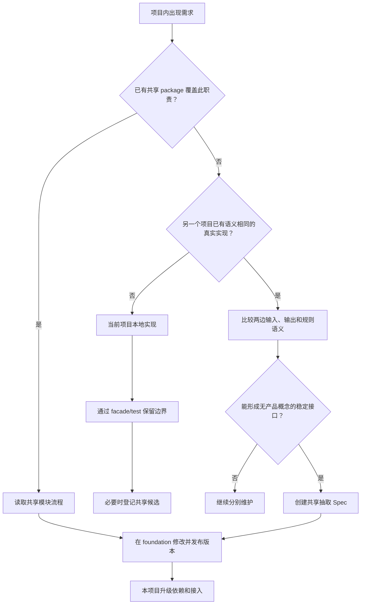

# AI+RPG 新项目脚手架准备方案

> 日期：2026-07-26  
> 状态：执行中  
> 当前阶段：开始玩法开发前的仓库、规范、架构和工程脚手架准备  
> 本文档不等于正式 MVP Spec，也不开始实现 RPG 玩法

## 1. 文档目标

本方案用于回答：

1. 新 RPG 项目在开始玩法开发前需要准备什么。
2. `ai-slg-game` 中哪些成熟做法应迁移。
3. 两个项目如何维护共同设计原则、开发规范和共享代码。
4. Agent 如何在不长期加载大量上下文的前提下，按需识别公共仓库任务。
5. 当前阶段哪些内容明确不做，避免提前建设“通用游戏引擎”。

输入材料：

- `AI驱动RPG_MVP开发Spec_v0.1.md`
- `ChatGPT Image 2026年7月26日 11_38_45.png`
- `ChatGPT Image 2026年7月26日 11_39_56.png`
- `ai-slg-game` 当前代码、文档、测试和开发流程

## 执行记录

- 2026-07-26：已创建 `F:\AI2\ai-rpg-game` 与 `F:\AI2\ai-game-foundation` 两个本地 sibling Git 仓库。
- 2026-07-26：已迁入原始设想材料，并归档为 `ai-rpg-game/docs/设想/`。
- 2026-07-26：已建立 `@ai-game/standards@0.1.0` 的本地 source package，并同步共同规范到 RPG。
- 2026-07-26：RPG 工程、根 AGENTS、文档骨架、快速质量闸门和共享目录查询已建立。
- 2026-07-26：RPG MVP 已确认需要通用 UI 原语；UI 成为正式开发的第一次共享实践，但只在首批界面 public API 明确后抽取最小集合。
- 2026-07-26：已确认游戏类型采用“武侠、仙侠、奇幻、科幻、都市、历史架空、末日”等固定选择，用于约束世界生成和 AI 绘图风格；具体剧情、角色和场景按玩家输入动态生成。

## 2. 当前结论

### 2.1 仓库布局

准备阶段建议形成：

```text
F:\AI2\
├── ai-slg-game\          # 三国 SLG 产品
├── ai-rpg-game\          # 新 AI+RPG 产品
└── ai-game-foundation\   # 已被两个产品确认需要的共享基础
```

`ai-game-foundation` 不是完整游戏引擎，不放：

- 通用 GameState；
- 通用战斗；
- 通用任务；
- 通用地图；
- 通用事件规则；
- SLG/RPG 玩法；
- 尚未出现第二个真实消费者的抽象。

它只接收已经确认应共享的基础能力：

- 共同文档及同步工具；
- 两个项目实际都使用的 UI 原语；
- 两个项目实际都使用的工程配置或测试工具；
- 后续由真实需求证明通用的 AI Runtime 等模块。

### 2.2 不建立完整引擎仓库

当前 `ai-slg-game` 的通用候选代码规模不大，而且部分模块只有一个产品消费者：

- action registry 和 round pipeline 基本只服务 SLG；
- 事件过滤仍带有势力、城市、人物语义；
- 存档实现仍带有季度摘要和 SLG 战斗回放语义；
- SLG 战斗不适合直接作为 RPG 小队战斗；
- AI Runtime 的复用证据相对充分，但 RPG 尚未开始真实接入。

因此准备阶段不建立 `ai-game-engine`，也不把 `src/game/core/` 整体迁出。

共享模块采用：

```text
第一次真实需求 → 当前项目实现
第二个真实消费者 → 比较语义
语义与契约确实相同 → 抽入 foundation
只是名称相似 → 继续分别维护
```

唯一例外：

> 如果某项需求已经明确属于现有共享 package 的职责，例如修复共享 Modal 的焦点管理，则直接在 `ai-game-foundation` 修改，不在游戏项目复制实现。

### 2.3 技术基线

RPG 默认与 SLG 使用同一技术方向：

| 类别 | 基线 |
|---|---|
| Web 框架 | Next.js App Router |
| UI | React |
| 语言 | TypeScript strict |
| 客户端状态 | Zustand |
| 持久化 | SQLite / libSQL，通过 Repository 隔离 |
| 测试 | Vitest + Testing Library |
| AI | OpenAI-compatible provider，server-only 调用 |
| 包管理 | npm + lockfile |
| 开发分支 | `.worktrees/<branch>` |

创建脚手架时优先复用 SLG 已验证版本。只有以下情况才引入不同技术：

- 当前技术无法覆盖明确需求；
- 新方案有可验证收益；
- 已评估对 SLG 的迁移价值和成本；
- 若两个项目都受益，先写 ADR，再分别升级。

不因新项目启动顺便重写 SLG 技术栈。

## 3. 准备阶段的非目标

本阶段不做：

- 正式 RPG GameState 设计；
- 任务、NPC、战斗、装备、地图等玩法实现；
- 接入真实 AI；
- 运行时图片和语音生成；
- 向量数据库；
- 完整账户系统；
- 通用游戏引擎；
- 把 SLG 业务代码复制到 RPG；
- 为假设中的未来需求创建通用框架；
- 完整实现 v0.1 Spec 中的 20 个 UI 页面。

本阶段完成后，项目应具备“可以安全开始第一个 RPG Spec/Plan”的条件。

## 4. 共同文档的维护方式

### 4.1 文档分类

共同文档和项目文档必须分开：

| 文档 | 维护位置 | 说明 |
|---|---|---|
| 共同游戏设计原则 | `ai-game-foundation` | 两个游戏都必须遵守 |
| 共同游戏开发规范 | `ai-game-foundation` | 分层、AI、测试、日志等共同规则 |
| 共享模块开发流程 | `ai-game-foundation` | 只在可能涉及公共能力时读取 |
| SLG 项目原则/规范 | `ai-slg-game` | SLG 特有 |
| RPG 项目原则/规范 | `ai-rpg-game` | RPG 特有 |
| 策划文档 | 各游戏项目 | 具体玩家可见规则 |
| Agent 系统文档 | 各游戏项目 | 当前代码事实和修改入口 |
| AGENTS.md | 各游戏项目 | 简短路由，不承载完整规范 |

共同原则和共同开发规范也应保持短小，只记录跨项目稳定规则。长示例、系统现状、历史过程和具体代码入口继续留在各项目的 agent 文档或过程文档中，避免每个设计/代码任务加载无关内容。

### 4.2 `@ai-game/standards`

共同文档通过独立 package 分发：

```text
ai-game-foundation/
└── packages/
    └── standards/
        ├── package.json
        ├── docs/
        │   ├── 共同游戏设计原则.md
        │   ├── 共同游戏开发规范.md
        │   └── 共享模块开发流程.md
        ├── catalog/
        │   └── 共享模块目录.json
        └── bin/
            └── sync-standards.mjs
```

package 中确实包含 Markdown，但 Agent 不直接读取 `node_modules`。

两个游戏运行：

```text
npm run sync:standards
```

将共同文档复制到本项目并提交 Git：

```text
docs/共同规范/
├── 共同游戏设计原则.md
├── 共同游戏开发规范.md
├── 共享模块开发流程.md
└── 共享模块目录.json
```

同步文件顶部包含：

```text
来源 package 和版本
自动同步、禁止直接修改
```

CI 运行：

```text
npm run check:standards
```

检查本地副本是否与当前安装版本一致。

### 4.3 项目文档只记录差异

RPG 本地继续维护：

```text
AGENTS.md
docs/游戏设计原则.md
docs/游戏开发规范.md
docs/Agent文档索引.md
docs/策划文档/
docs/agent/
docs/superpowers/specs/
docs/superpowers/plans/
docs/superpowers/reviews/
docs/decisions/
docs/operations/
```

其中：

- `docs/游戏设计原则.md` 只写 RPG 特有原则和对共同原则的明确补充。
- `docs/游戏开发规范.md` 只写 RPG 的代码路径、模块边界和特殊实现约束。
- 不重复粘贴共同规范全文。
- 共同规范改变时升级 `@ai-game/standards` 并重新同步。

## 5. 精简 `AGENTS.md`

### 5.1 设计目标

根 `AGENTS.md` 每次对话都会进入上下文，因此只保留：

- 文档路由；
- 共同原则入口；
- 公共仓库检查的触发条件；
- worktree 等最核心约束。

详细规则全部放入按需读取的文档。

目标长度约 20–30 行，不在根文件写完整公共模块流程。

### 5.2 RPG 根 `AGENTS.md` 建议内容

```md
## 文档路由

- 设计玩法/系统：先读 `docs/共同规范/共同游戏设计原则.md`，
  再读 `docs/游戏设计原则.md`、`docs/Agent文档索引.md`
  和对应 `docs/agent/<系统>.md`
- 编写/修改代码：先读 `docs/共同规范/共同游戏开发规范.md`，
  再读 `docs/游戏开发规范.md`、`docs/Agent文档索引.md`
  和对应 `docs/agent/<系统>.md`
- 已读文档在同一任务内不重复读取，除非任务边界或实现事实变化

## 共享基础设施触发

只有当任务涉及现有 `@ai-game/*` package、通用 UI/AI/日志/测试配置，
或准备创建明显无 RPG 业务语义的底层模块时，才读取：

- `docs/共同规范/共享模块开发流程.md`
- `docs/共同规范/共享模块目录.json`

未命中以上条件时，不加载共享模块流程。

## 文档维护

- 玩法事实变化：更新 `docs/策划文档/`
- 实现事实变化：更新 `docs/agent/` 和索引
- 共同规则或公共 package 变化：按共享模块流程处理

## 核心约束

- 分支放 `.worktrees/`，不用 `git checkout`
```

### 5.3 何时触发公共仓库文档

Agent 仅在以下情况进一步读取共享流程：

1. 修改或升级 `@ai-game/*` package。
2. 修改当前由共享 package 提供的能力。
3. 准备在项目内新建以下类别的无业务模块：
   - UI 原语；
   - AI transport/retry/JSON parser；
   - 日志 envelope/trace/redaction；
   - TypeScript/ESLint/Vitest 配置；
   - boundary test helper；
   - 通用 Repository/数据库 primitive。
4. 发现 SLG 已有语义相同的实现。
5. 用户明确要求两个项目同步优化。
6. 模块输入输出中没有 RPG 领域类型，且看起来会被两个产品消费。

以下情况不触发：

- NPC 对话业务组件；
- RPG 任务、物品、战斗和地点规则；
- RPG GameState；
- RPG prompt 和输出 schema；
- 单个页面布局；
- 只属于 RPG 的美术和主题；
- 普通 bug 修复且不涉及 `@ai-game/*`。

## 6. 共享模块的开发决策



### 6.1 已有共享职责

如果需求属于已有 package：

```text
共享仓库先修改
→ package 测试
→ 两个消费者兼容测试
→ npm run ready:family
→ foundation、SLG、RPG 依次提交、合并和推送
```

禁止在项目内写一份临时替代实现。

如果当前会话不能修改 sibling 公共仓库，Agent 应报告并申请明确权限，不能静默复制。

### 6.2 第一次出现的新能力

默认在当前游戏项目内实现：

- 文件名和职责明确；
- 对外只通过 facade；
- 规则纯函数有测试；
- 外部依赖通过 port/adapter；
- 不为了“以后可能共享”增加无用泛型和配置。

只有真实出现第二个消费者后才评估抽取。

### 6.3 抽取条件

同时满足以下条件才进入 foundation：

- 两个生产项目真实使用；
- 输入输出语义相同；
- 公共实现不需要导入任一游戏的 domain；
- 有清晰 public API；
- 有独立测试；
- 两个消费者都有 contract test；
- 抽取后的理解和维护成本低于两份实现。

### 6.4 公共变更必须原子验收

两个游戏固定通过内部 sibling package 消费：

```json
{
  "@ai-game/ui": "file:.foundation/packages/ui"
}
```

package 的语义版本记录 API 契约，但不发布外部 registry。公共修改必须在三个同名 worktree 中运行 package 测试和两个消费者 contract test，再按 foundation、SLG、RPG 顺序独立提交，便于审查和回滚。

## 7. 脚手架目标目录

```text
ai-rpg-game/
├── AGENTS.md
├── README.md
├── package.json
├── package-lock.json
├── tsconfig.json
├── next.config.ts
├── eslint.config.mjs
├── vitest.config.ts
├── .env.example
├── .gitignore
├── docs/
│   ├── 共同规范/
│   ├── 游戏设计原则.md
│   ├── 游戏开发规范.md
│   ├── Agent文档索引.md
│   ├── 设想/
│   ├── 策划文档/
│   │   └── README.md
│   ├── agent/
│   │   ├── README.md
│   │   └── template.md
│   ├── superpowers/
│   │   ├── specs/
│   │   ├── plans/
│   │   └── reviews/
│   ├── decisions/
│   └── operations/
├── data/
│   ├── base/
│   ├── worlds/
│   └── fixtures/
├── public/
│   └── assets/
├── scripts/
│   ├── doctor.mjs
│   └── checkSharedBoundaries.mjs
├── src/
│   ├── app/
│   │   ├── api/
│   │   ├── layout.tsx
│   │   └── page.tsx
│   ├── components/
│   │   └── ui/
│   ├── game/
│   │   ├── domain/
│   │   ├── gameplay/
│   │   │   └── rpg/
│   │   ├── application/
│   │   │   └── server/
│   │   ├── scenario/
│   │   └── logging/
│   ├── store/
│   ├── test-setup.ts
│   └── dependencyBoundaries.test.ts
└── .worktrees/
```

空目录通过 README 或后续真实文件建立，不为保持目录结构创建无意义实现。

## 8. 代码分层边界

### 8.1 `domain`

未来保存 RPG 稳定领域类型和纯函数。

禁止依赖：

- gameplay；
- application；
- UI/store；
- API；
- AI provider；
- 数据库实现。

脚手架阶段不预先设计完整 GameState。

### 8.2 `gameplay/rpg`

未来保存：

- 行为合法性；
- 判定；
- 任务；
- NPC 知识；
- 关系；
- 战斗；
- 装备；
- 世界事件。

不能依赖 application、UI、store。

### 8.3 `application`

未来保存：

- 用例 facade；
- read model；
- request adapter；
- 多个 gameplay 操作的编排。

application 不直接修改玩法数值。

### 8.4 `application/server`

未来保存：

- AI provider；
- 数据库 Repository 组合；
- 图片/语音 adapter；
- server-only 配置；
- 密钥读取。

必须通过边界测试阻止客户端导入。

### 8.5 UI/API/store

- UI 只消费 application read model/use case。
- API route 只校验输入、建立 trace、调用 application、映射响应。
- store 不直接 import gameplay 内部实现。
- 通用 UI 优先消费 `@ai-game/ui-react`；RPG 主题和业务组合留在本项目。

## 9. UI 共享的准备策略

### 9.1 不预先抽取全部 UI

准备阶段不把 SLG 所有 UI 搬入 foundation。

当 RPG 脚手架真实需要第一个 Modal/Panel/Tab 时：

1. 对比 SLG 的现有 UI 原语。
2. 确认组件没有 SLG domain 依赖。
3. 抽取最小集合和原测试到 `@ai-game/ui-react`。
4. 将视觉样式改为语义 token。
5. SLG 迁移为 package 消费者，确认行为不变。
6. RPG 使用同一 package。

第一批候选：

- `Panel`
- `InlineButton`
- `TabBar`
- `Tag`
- `SortableHeader`
- `SurfaceRoot` 中的通用 Surface/focus/portal 机制

不抽：

- `GameViewport`
- `MapHudLayer`
- `WorldMap`
- 三国主题 CSS
- 业务 Modal
- 人物/势力/城市组件

### 9.2 主题分离

共享 UI 只使用语义 token：

```text
--game-surface-bg
--game-surface-border
--game-text-primary
--game-accent
--game-danger
--game-shadow-modal
```

SLG/RPG 分别提供主题值，公共组件不包含题材颜色和美术。

## 10. 准备工作的实施阶段

### Phase 0：确认路径和权限

目标：

- 正式 RPG 路径为 `F:\AI2\ai-rpg-game`；
- 当前 `new-rpg-game/设想/` 的三份材料迁入新仓库；
- 不在 `ai-slg-game` 内创建嵌套 Git 仓库；
- 确认 sibling 路径写入授权；
- 确认 Git 默认分支和远程仓库策略。

交付：

```text
F:\AI2\ai-rpg-game\.git
F:\AI2\ai-rpg-game\docs\设想\...
```

### Phase 1：建立最小 foundation

初始只创建：

```text
ai-game-foundation/
├── AGENTS.md
├── package.json
├── packages/
│   └── standards/
└── docs/
    └── decisions/
```

交付：

- `@ai-game/standards`
- 三份共同文档
- 共享模块目录
- sync/check CLI
- package 自身测试
- 版本和 changelog 规则

不创建空的 `engine/core/persistence/ai-runtime` package。

### Phase 2：初始化 RPG 工程

从 SLG 复用已验证的技术配置：

- Node/npm 版本；
- Next.js/React/TypeScript；
- ESLint；
- Vitest/Testing Library；
- path alias；
- npm scripts；
- `.env.example` 结构；
- `.gitignore`；
- `test-setup`；
- `next.config` 中与 worktree 相关的设置。

保留 RPG 项目名和空白业务页面，不复制三国页面和 store。

### Phase 3：建立文档脚手架

交付：

- 精简根 `AGENTS.md`；
- 同步的共同规范；
- RPG 游戏设计原则；
- RPG 游戏开发规范；
- Agent 文档索引；
- agent README/template；
- 策划文档 README；
- specs/plans/reviews/decisions/operations 目录边界说明。

RPG 项目原则初始只记录已经确认的差异：

- 玩家输入是行动意图；
- NPC 知识受结构化事实限制；
- 失败应有反馈且尽可能推进剧情；
- AI 不得直接修改规则和状态；
- 图片和语音失败不阻塞主流程。

不把 v0.1 Spec 全部提升为正式规则。

### Phase 4：建立架构闸门

交付 boundary tests：

- domain 禁止向上依赖；
- gameplay 禁止依赖 application/UI/store；
- UI/API/store 禁止 deep-import gameplay；
- server-only 禁止进入客户端；
- facade 禁止 deep import；
- `@ai-game/*` 只能从 package public export 导入；
- 共享模块目录中禁止的本地重复文件不能出现。

命令：

```text
npm run typecheck
npm run test:boundaries
npm run test:fast
```

### Phase 5：建立开发体检和 CI

交付：

```text
npm run setup
npm run doctor
npm run dev
npm run lint
npm run typecheck
npm test
npm run test:boundaries
npm run test:fast
npm run build
npm run sync:standards
npm run check:standards
```

`doctor` 至少检查：

- Node/npm 版本；
- lockfile；
- 环境变量示例完整性；
- 共同规范同步状态；
- TypeScript alias；
- 必要目录和 facade；
- 禁止嵌套仓库/错误工作目录。

CI 至少执行：

```text
check:standards
lint
typecheck
test:boundaries
test
build
```

### Phase 6：按真实使用抽取第一批 UI

只有当 RPG Shell 开始使用 Panel/Modal/Tab 时执行。

交付：

- `@ai-game/ui-react` 最小 public API；
- 公共 UI 自身测试；
- SLG consumer contract；
- RPG consumer contract；
- 两个项目使用精确 package 版本；
- SLG/RPG 各自主题。

如果 RPG 初始空壳还未使用这些组件，则本阶段延后，不为“以后可能使用”创建 package。

### Phase 7：脚手架验收

验收后才开始正式 RPG MVP Scope Spec。

## 11. 脚手架完成标准

### 仓库

- [ ] `ai-rpg-game` 是 sibling 独立 Git 仓库。
- [ ] 原始设想材料已迁入并标记为设想，不是正式基线。
- [ ] 没有嵌套 Git 仓库。
- [ ] main 工作目录不直接开发功能分支。

### 工程

- [ ] Next.js 空壳可以启动和构建。
- [ ] TypeScript strict。
- [ ] Vitest 和 Testing Library 可运行。
- [ ] Zustand 已安装但没有复制 SLG store。
- [ ] SQLite/libSQL 技术方向已保留，但没有复制 SLG 存档业务。
- [ ] setup/doctor/test/build 命令可用。

### 文档

- [ ] 根 AGENTS 足够短，只包含路由和触发条件。
- [ ] 共同规范通过 `@ai-game/standards` 同步。
- [ ] 项目原则只记录 RPG 差异。
- [ ] Agent 文档模板和索引存在。
- [ ] spec/plan/review 过程资料与权威文档边界明确。

### 架构

- [ ] domain/gameplay/application/UI 目录和 facade 规则建立。
- [ ] 故意跨层 import 会被测试拦截。
- [ ] server-only 代码不能进入客户端。
- [ ] 没有提前定义通用 GameState、任务或战斗引擎。

### 共享能力

- [ ] Agent 只有命中触发条件才读取共享模块流程。
- [ ] 共享模块目录可以在本地查询。
- [ ] 已有共享能力禁止本地复制。
- [ ] 新能力第一次出现默认项目内实现。
- [ ] 第二个真实消费者出现后才评估抽取。
- [ ] 公共 package 使用精确版本和消费者契约测试。

## 12. 脚手架完成后的第一个正式任务

脚手架完成后，不直接按现有 v0.1 Spec 全量开发。

第一个正式设计任务是：

```text
AI+RPG MVP Scope 收敛 Spec
```

应确认：

- 首个垂直切片时长；
- 地点、NPC、任务和战斗数量；
- AI 第一阶段只接入哪些能力；
- 哪些内容使用确定性模板；
- 第一个完整结局；
- 无 AI 时能否跑通；
- 存档最小状态；
- 验收和固定 seed 回归路径。

完成 Scope Spec 和对应 Plan 后，再进入 RPG 玩法开发。

## 13. 已确认决策与后续门槛

已确认：

1. RPG 正式仓库名为 `ai-rpg-game`。
2. 共享基础仓库名为 `ai-game-foundation`。
3. `@ai-game/*` 仅供三个 Private GitHub 仓库内部使用，固定通过 sibling 本地 package 分发，禁止发布外部 registry。
4. 脚手架阶段不预建 UI package；RPG MVP 首批界面开始前，以真实消费者契约抽取最小 `@ai-game/ui`，作为共享流程的第一次实践。
5. 三个仓库均使用 Private GitHub 远程；代码 package 仍通过 sibling 本地路径消费。
6. 两个 sibling 仓库均已在 `F:\AI2` 创建。

正式 MVP 范围已经收敛到 `docs/策划文档/AI生成RPG_MVP.md`，可执行开发约束见 `docs/superpowers/specs/2026-07-26-ai-rpg-mvp-development-spec.md`。实际编码前仍需为 Phase 0 创建功能分支/worktree 和执行 Plan。
