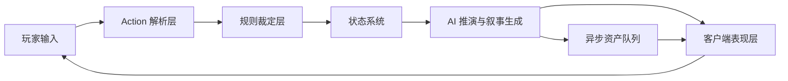
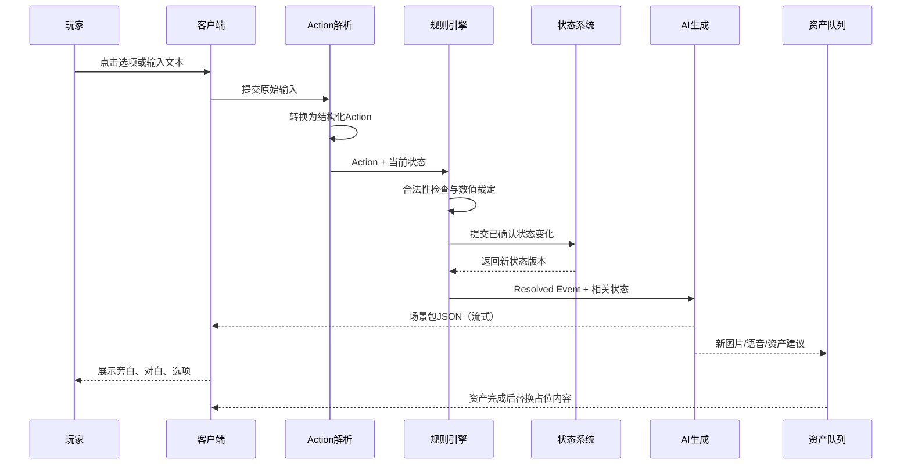

# AI 实时演算 RPG：核心规则与运行架构总纲

> 文档版本：v0.1  
> 文档定位：项目零号设计文档  
> 适用阶段：产品原型、技术架构、MVP 范围确认  
> 核心目标：明确玩家、AI、规则引擎和游戏状态如何共同推动游戏

---

## 1. 项目目标

本项目要实现的不是“AI 预先写好剧情的 RPG”，也不是传统的分支剧情树，而是一个由玩家持续输入、AI 实时推演、规则系统约束并落地的动态叙事 RPG。

玩家可以：

- 点击系统提供的固定选项；
- 输入自然语言，自由表达行动、询问、态度或计划；
- 与 NPC 对话；
- 探索地点和场景；
- 进行战斗；
- 获取、使用、交易或赠送道具；
- 改变 NPC 关系、阵营关系和世界状态；
- 通过自己的行为推动独特的故事走向。

不同玩家即使从相同的世界设定开始，也应当因为行动、选择和自由输入不同，逐渐形成不同的故事。

### 1.1 核心设计原则

> **玩家决定意图，AI提出推演，规则裁定事实，状态记录世界，AI呈现故事。**

这五者不能混为一体：

1. **玩家**决定自己想做什么。
2. **AI**理解玩家意图，并提出合理的世界变化和叙事发展。
3. **规则引擎**判断行动是否合法、是否成功、产生哪些确定结果。
4. **状态系统**保存已经发生且不可随意篡改的世界事实。
5. **AI叙事层**把已确认的结果表现为场景、对白、情绪、冲突和后续选项。

### 1.2 项目不应变成什么

本项目不应变成：

- 提前生成整棵剧情树；
- 玩家选择看似很多，但最终都回到同一条固定剧情；
- AI可以无视数值、物品、地点和人物关系随意编造；
- 每个 NPC 都知道全世界所有秘密；
- 每次操作都串行调用多个大模型，导致玩家等待几十秒；
- AI负责保存世界事实，出现前后矛盾和“失忆”；
- 为了追求自由输入，放弃游戏规则和可玩性。

---

## 2. 顶层架构

整个系统分为六个核心部分。



### 2.1 玩家输入层

接收两类输入：

#### 固定选项

固定选项本身已经携带结构化 Action，不需要 AI 再理解一次。

例如：

```json
{
  "label": "把药交给受伤的猎人",
  "action": {
    "type": "give_item",
    "actor_id": "player",
    "target_id": "npc_hunter_01",
    "item_id": "item_healing_potion",
    "quantity": 1
  }
}
```

#### 自由输入

玩家可以输入：

> 我把刀架在酒馆老板脖子上，逼他告诉我失踪商队的下落。

这类输入必须先转换为结构化 Action，再交给规则系统处理。

---

## 3. AI 与规则的职责边界

这是整个项目最重要的边界。

### 3.1 AI 负责什么

AI负责无法完全通过代码预设的开放性内容：

- 理解玩家自然语言的真实意图；
- 判断玩家是在询问、威胁、欺骗、调查还是行动；
- 根据当前世界状态提出合理的剧情发展；
- 设计当下场景中的冲突、转折和信息揭示；
- 生成 NPC 对白和反应；
- 生成旁白、环境描写和情绪表现；
- 提供两个符合当前情境的推荐选项；
- 在必要时提出新 NPC、新地点、新事件或新道具；
- 根据 Story State 控制节奏、张力和收束方向；
- 让不同玩家的行动产生不同的叙事意义。

AI可以**提出世界变化**，但不能绕过规则系统直接把变化写入正式状态。

### 3.2 规则引擎负责什么

规则引擎是唯一的事实裁判，负责：

- 验证行动是否合法；
- 检查玩家是否拥有所需能力、物品、位置或权限；
- 检查目标人物、地点、道具是否真实存在；
- 计算战斗、伤害、命中、资源消耗和奖励；
- 计算探索、调查、交涉、欺骗等行为的成功与失败；
- 更新玩家属性、背包、任务、关系和阵营状态；
- 判断事件触发条件是否满足；
- 检查 AI 提议的新内容是否违反世界观、预算或已有事实；
- 把确认后的变化写入 World State；
- 生成一份不可歧义的 `Resolved Event`。

### 3.3 状态系统负责什么

状态系统是游戏的长期记忆，不依赖模型记忆。

它负责保存：

- 世界中已经存在的事实；
- 玩家和 NPC 当前状态；
- 已经发生的事件；
- 已知与未知的信息；
- 地点、物品和任务状态；
- 故事进度与节奏指标；
- 哪些秘密分别被哪些角色知道；
- 哪些内容已经死亡、销毁、解锁或永久改变。

### 3.4 客户端负责什么

客户端负责：

- 接收和展示结构化输出；
- 渲染场景、NPC、对白和选项；
- 播放移动、探索、战斗和过场动画；
- 在重资源尚未完成时展示占位图或已有资产；
- 通过流式文本、动作反馈和转场减少等待感；
- 禁止玩家在服务器尚未提交状态时重复触发冲突操作。

---

## 4. Director 的重新定义

Director 不应被理解为一个每回合都必须单独调用的 AI 角色。

更合适的定义是：

> **Director = Story State + 节奏规则 + 必要时的 AI 创意判断。**

### 4.1 Director 的固定部分

以下内容适合由代码和状态维护：

- 游戏长度：短篇、中篇、长篇；
- 当前幕数；
- 预计总幕数；
- 当前剧情张力；
- 主线进度；
- 已使用 NPC 数量；
- 已使用地点数量；
- 战斗密度；
- 信息揭示进度；
- 是否接近高潮；
- 是否允许进入结局；
- 当前仍未回收的伏笔；
- 当前故事预算。

示例：

```json
{
  "story_length": "short",
  "current_act": 2,
  "target_acts": 3,
  "story_progress": 58,
  "tension": 66,
  "npc_budget": {
    "used": 6,
    "max": 10
  },
  "location_budget": {
    "used": 3,
    "max": 5
  },
  "unresolved_threads": [
    "missing_caravan",
    "mayor_secret"
  ],
  "ending_allowed": false
}
```

### 4.2 Director 的 AI 部分

AI不负责决定“张力值是多少”，但可以根据张力值决定如何表现。

例如当前张力为 80，AI可以选择：

- 安排追兵突然出现；
- 让盟友暴露背叛；
- 揭示关键真相；
- 让玩家必须在两种代价之间选择。

代码负责边界，AI负责创意。

### 4.3 是否需要独立 Director API

默认不需要每回合独立调用 Director API。

推荐方案：

- 初始化时生成一次 `Story Contract`；
- 每回合将 Story State 作为上下文交给主要生成模型；
- 主要模型一次性完成当前场景推演、NPC 对白、选项和资产建议；
- 只有在章节切换、剧情严重偏离、长期故事重新规划时，才触发低频的 Director 重规划调用。

这样既保留节奏控制，也避免每回合多一次模型延迟。

---

## 5. 核心状态模型

游戏至少需要四类状态。

### 5.1 World State

记录客观世界事实。

```json
{
  "world_id": "world_001",
  "time": {
    "day": 3,
    "period": "night"
  },
  "weather": "heavy_rain",
  "active_locations": [
    "town_ashvale",
    "tavern_black_stag",
    "forest_north"
  ],
  "global_flags": {
    "bridge_destroyed": false,
    "town_under_attack": false
  },
  "factions": {
    "town_guard": {
      "attitude_to_player": -10
    }
  }
}
```

### 5.2 Player State

记录玩家自身状态。

```json
{
  "player_id": "player",
  "location_id": "tavern_black_stag",
  "hp": 74,
  "max_hp": 100,
  "level": 3,
  "skills": {
    "combat": 4,
    "persuasion": 2,
    "investigation": 3
  },
  "inventory": [
    {
      "item_id": "item_healing_potion",
      "quantity": 1
    }
  ],
  "statuses": [
    "injured_arm"
  ],
  "reputation": {
    "town_guard": -10,
    "hunters_guild": 15
  }
}
```

### 5.3 Entity State

记录 NPC、地点、道具和敌人的状态。

NPC 不应直接读取全世界信息，而应维护独立知识边界。

```json
{
  "npc_id": "npc_tavern_owner",
  "name": "格兰特",
  "location_id": "tavern_black_stag",
  "alive": true,
  "attitude_to_player": -5,
  "personality": [
    "谨慎",
    "现实",
    "害怕卫兵"
  ],
  "known_facts": [
    "caravan_arrived_two_days_ago",
    "guard_captain_met_caravan_leader"
  ],
  "hidden_facts": [
    "accepted_smuggler_payment"
  ],
  "goals": [
    "protect_tavern",
    "avoid_guard_investigation"
  ]
}
```

### 5.4 Story State

记录故事结构和节奏，不等于世界事实。

```json
{
  "current_act": 1,
  "story_progress": 22,
  "tension": 35,
  "current_objective": "调查失踪商队",
  "active_threads": [
    "missing_caravan",
    "corrupt_guard"
  ],
  "recent_beats": [
    "玩家发现沾血的货运清单"
  ],
  "next_pacing_need": "reveal_or_complication",
  "ending_allowed": false
}
```

---

## 6. Action 结构

Action 是玩家输入进入规则层前的统一格式。

### 6.1 通用字段

```json
{
  "action_id": "act_000123",
  "source": "fixed_choice",
  "type": "talk",
  "actor_id": "player",
  "target_id": "npc_tavern_owner",
  "location_id": "tavern_black_stag",
  "raw_input": "问老板是否见过失踪商队",
  "parameters": {},
  "client_context": {
    "scene_id": "scene_009",
    "turn_id": 18
  }
}
```

### 6.2 推荐字段说明

| 字段 | 说明 |
|---|---|
| `action_id` | 本次行动唯一 ID，用于防止重复提交 |
| `source` | `fixed_choice` 或 `free_text` |
| `type` | 标准动作类型 |
| `actor_id` | 行动发起者 |
| `target_id` | 行动目标，可为空 |
| `location_id` | 行动发生地点 |
| `raw_input` | 玩家原始输入 |
| `parameters` | 动作特有参数 |
| `client_context` | 场景、回合和客户端上下文 |

### 6.3 标准 Action 类型

建议 MVP 先支持以下类型：

| Action 类型 | 作用 |
|---|---|
| `talk` | 与 NPC 对话、询问、表达态度 |
| `move` | 前往已知地点或场景 |
| `explore` | 探索当前地点 |
| `inspect` | 调查人物、物品、痕迹或环境 |
| `collect` | 获取可拾取物品 |
| `use_item` | 使用道具 |
| `give_item` | 将道具交给 NPC |
| `trade` | 买卖或交换物品 |
| `attack` | 发起战斗或攻击 |
| `defend` | 防御、格挡或保护目标 |
| `flee` | 逃离战斗或危险场景 |
| `interact` | 操作机关、门、容器、环境物件 |
| `accept_quest` | 接受任务 |
| `submit_quest` | 提交任务或任务物品 |
| `rest` | 休息、恢复或等待时间流逝 |
| `freeform` | 暂时无法稳定归类的开放行动 |

### 6.4 固定选项与自由输入的区别

#### 固定选项

- 由系统提前附带标准 Action；
- 不需要额外调用 AI 做意图识别；
- 可以直接进入规则裁定；
- 响应更快、更稳定。

#### 自由输入

- 先由轻量模型或主模型的解析阶段转成 Action；
- 可能包含多个意图；
- 必须检查玩家是否在“声明结果”而不是“提出行动”。

例如玩家输入：

> 我的武功突然升到一百级。

不能解析成：

```json
{
  "type": "set_level",
  "level": 100
}
```

而应解析为一种表达、尝试或愿望：

```json
{
  "type": "freeform",
  "intent": "claim_power_increase",
  "requested_effect": {
    "level": 100
  }
}
```

规则系统随后拒绝该效果，世界状态不变。AI可以让 NPC 对此表示疑惑、嘲笑或追问，但不能真的把等级改成 100。

---

## 7. 单回合完整运行流程

### 7.1 标准流程



### 7.2 具体步骤

1. 玩家点击选项或输入自由文本。
2. 系统生成标准 Action。
3. 规则引擎读取当前状态并进行裁定。
4. 规则引擎输出 `Resolved Event`。
5. 状态系统原子性提交本次变化，生成新的状态版本。
6. AI只读取与当前场景相关的状态切片。
7. AI生成当前场景包：
   - 旁白；
   - NPC 对白；
   - 推荐选项；
   - 新内容提案；
   - 资产生成需求。
8. 客户端展示结果。
9. 图片、语音和大型资产异步生成，不阻塞主流程。

---

## 8. Resolved Event：规则层的确定结果

AI生成叙事前，必须先得到规则层确认的事件结果。

```json
{
  "event_id": "evt_00182",
  "action_id": "act_000123",
  "status": "success",
  "event_type": "information_revealed",
  "facts": [
    {
      "type": "npc_spoke_fact",
      "npc_id": "npc_tavern_owner",
      "fact_id": "guard_captain_met_caravan_leader"
    }
  ],
  "state_changes": [
    {
      "path": "npc_tavern_owner.attitude_to_player",
      "operation": "add",
      "value": 2
    }
  ],
  "costs": [],
  "rewards": [],
  "triggered_events": [
    "guard_spy_overheard_conversation"
  ],
  "rejected_effects": [],
  "state_version": 219
}
```

### 8.1 失败和部分成功

规则结果不应只有成功或失败，还应支持：

- `success`
- `partial_success`
- `failure`
- `blocked`
- `invalid`
- `success_with_cost`

例如玩家威胁酒馆老板：

```json
{
  "status": "partial_success",
  "facts": [
    "老板承认见过商队队长"
  ],
  "costs": [
    "老板对玩家好感下降 15",
    "酒馆中的卫兵开始警觉"
  ]
}
```

AI根据这个确定结果写出老板的反应，但不能把“部分成功”擅自写成彻底招供。

---

## 9. AI 场景生成输入与输出

### 9.1 AI 输入原则

AI不应接收整个数据库，而应接收最小必要上下文。

一次生成通常需要：

- 当前玩家状态摘要；
- 当前地点状态；
- 当前在场 NPC；
- 当前 NPC 可知信息；
- 当前 Story State；
- 本次 Resolved Event；
- 最近少量关键事件；
- 世界观硬约束；
- 输出 JSON Schema。

### 9.2 NPC 知识隔离

当酒馆老板说话时，不应把其他 NPC 的私人秘密直接放进他的可见上下文。

推荐上下文分层：

- `public_world_facts`
- `scene_visible_facts`
- `npc_known_facts`
- `npc_beliefs`
- `npc_hidden_motives`
- `forbidden_knowledge`

这样即使使用同一个模型，也能让不同 NPC 只根据自己的知识作答。

**NPC 是否泄密，主要取决于输入上下文和规则约束，而不是是否为每个 NPC 单独创建一个 AI Agent。**

### 9.3 AI 场景包输出

推荐一次模型调用返回完整的结构化场景包。

```json
{
  "scene_id": "scene_010",
  "presentation": {
    "narration": "老板擦杯子的动作停了半拍，目光越过你的肩膀，看向角落里的卫兵。",
    "dialogue": [
      {
        "speaker_id": "npc_tavern_owner",
        "text": "见过。但有些问题，在这里问并不安全。",
        "emotion": "guarded"
      }
    ]
  },
  "choices": [
    {
      "label": "压低声音，问他谁在监视",
      "action": {
        "type": "talk",
        "target_id": "npc_tavern_owner",
        "parameters": {
          "intent": "ask_about_surveillance"
        }
      }
    },
    {
      "label": "假装结束谈话，观察酒馆里的人",
      "action": {
        "type": "inspect",
        "target_id": "tavern_room",
        "parameters": {
          "focus": "suspicious_people"
        }
      }
    }
  ],
  "proposals": {
    "new_entities": [],
    "new_events": [
      {
        "type": "possible_tail",
        "reason": "玩家已引起监视者注意"
      }
    ]
  },
  "asset_requests": [
    {
      "type": "expression",
      "entity_id": "npc_tavern_owner",
      "variant": "guarded"
    }
  ]
}
```

### 9.4 AI 输出的处理方式

AI输出字段分为两类：

#### 可以直接展示

- 旁白；
- 对白；
- 情绪标签；
- 已批准 Action 对应的选项文案；
- 镜头和动画建议。

#### 必须再次验证后才能写入状态

- 新 NPC；
- 新地点；
- 新道具；
- 新任务；
- 世界事实改变；
- 角色死亡；
- 阵营变化；
- 奖励和数值变化。

---

## 10. AI 如何真正推动游戏

“规则决定事实”不等于“AI只负责润色”。

AI仍然是动态故事推进的核心创意来源，但它的推进方式是**提出经过规则验证的变化**。

### 10.1 AI 推动游戏的四种方式

#### 1. 解释玩家行动的叙事意义

玩家只是说：

> 我把药给猎人。

规则只确认：

- 玩家拥有药；
- 药减少一瓶；
- 猎人伤势缓解；
- 猎人好感增加。

AI可以进一步提出：

- 猎人因此愿意透露森林里的异常；
- 猎人决定带玩家走一条秘密小路；
- 猎人认出药瓶来自某个失踪组织。

这些是动态叙事推进，不是简单润色。

#### 2. 根据状态制造合理的新冲突

如果 Story State 显示：

- 张力偏低；
- 玩家连续两轮没有遇到阻力；
- 当前处于第二幕；
- 主线需要复杂化；

AI可以提出一个新事件：

> 玩家离开酒馆时发现有人跟踪。

规则系统再检查：

- 当前是否存在可用敌对势力；
- 该势力是否知道玩家；
- 当前地点是否允许该事件；
- 是否超出 NPC 和事件预算。

通过后才正式加入世界。

#### 3. 让世界对玩家过去行为作出反应

AI读取已确认历史：

- 玩家曾威胁老板；
- 曾帮助猎人；
- 被卫兵通缉。

因此生成不同的场景和 NPC 态度。故事走向来自玩家积累的状态，而非固定章节。

#### 4. 提出下一步可能行动

AI生成的两个固定选项不是提前写死的剧情分支，而是基于当前世界状态提出的推荐 Action。

玩家仍然可以完全无视选项，输入其他内容。

### 10.2 AI不能做的事情

AI不能：

- 凭空宣布玩家获得不存在的神器；
- 让已经死亡的 NPC 无解释地复活；
- 让不知情的 NPC 说出秘密；
- 跳过战斗规则直接判定胜负；
- 因为叙事需要就篡改玩家背包；
- 把尚未批准的新地点当作既有地点；
- 无视 Story State 无限增加人物和场景。

---

## 11. 常见游戏玩法的处理规则

### 11.1 NPC 对话

**规则负责：**

- NPC 是否在场；
- NPC 是否愿意交流；
- NPC 知道哪些信息；
- 玩家关系、声望和交涉能力；
- 是否触发信息揭示或关系变化。

**AI负责：**

- NPC 的具体说法；
- 语气、情绪和潜台词；
- 根据 NPC 性格进行合理回应；
- 产生推荐的后续对话选项。

### 11.2 探索场景

**规则负责：**

- 当前地点可探索内容；
- 隐藏物是否存在；
- 探索次数、时间和资源消耗；
- 调查能力判定；
- 发现哪些确定内容。

**AI负责：**

- 环境描写；
- 发现过程；
- 线索之间的叙事联系；
- 场景气氛和悬念。

### 11.3 战斗

**规则负责：**

- 回合顺序；
- 命中、伤害、护甲和状态；
- 技能消耗；
- 敌人死亡、逃跑或投降；
- 战利品；
- 战斗结束条件。

**AI负责：**

- 动作表现；
- 敌人语言和情绪；
- 战斗节奏描述；
- 特殊结果的戏剧化表达。

### 11.4 获取道具

**规则负责：**

- 道具是否存在且可拾取；
- 背包容量；
- 所有权和偷窃判定；
- 数量变化。

**AI负责：**

- 玩家如何发现道具；
- 道具的外观和叙事意义；
- NPC 对获取行为的反应。

### 11.5 使用道具

**规则负责：**

- 玩家是否拥有道具；
- 使用目标是否合法；
- 道具效果和消耗；
- 冷却、限制和副作用。

**AI负责：**

- 使用过程；
- 感官反馈；
- NPC 和环境反应。

### 11.6 赠送道具给 NPC

**规则负责：**

- 玩家是否拥有道具；
- NPC 是否接受；
- 任务条件是否满足；
- 关系和状态变化；
- 是否触发新的任务或信息。

**AI负责：**

- NPC 的具体反应；
- 礼物对人物关系的意义；
- 后续剧情表达。

### 11.7 前往某个地点

**规则负责：**

- 地点是否存在；
- 玩家是否知道该地点；
- 路径是否可达；
- 是否满足进入条件；
- 移动时间和途中事件。

**AI负责：**

- 移动过程；
- 转场描述；
- 抵达后的场景表现。

如果玩家说“去少林寺”，而当前世界没有少林寺：

- 规则结果：地点不存在，移动失败，世界状态不变；
- AI表现：NPC可以回答没听说过，或询问玩家是不是记错了；
- AI不能擅自把少林寺永久加入世界；
- 若世界观允许，AI可以提出创建一个类似地点，但必须经过新地点审批规则。

---

## 12. 新 NPC、新地点和新道具的生成规则

AI实时演算必须允许世界扩展，但扩展不能失控。

### 12.1 新内容生成条件

只有满足以下条件之一，才考虑创建新内容：

- 玩家行动明确需要；
- 当前世界没有可复用实体；
- 主线或支线需要；
- Story State 要求引入变化；
- 当前内容预算允许；
- 新内容与世界观不冲突。

### 12.2 优先复用，后生成

生成前按以下顺序检查：

1. 是否已有适合的 NPC；
2. 是否已有适合的地点；
3. 是否可以修改现有实体承担功能；
4. 是否确实必须新建。

例如需要一个知道森林情况的人，应优先使用已存在的猎人，而不是立即生成第二个功能相同的 NPC。

### 12.3 新实体提案

AI先返回提案：

```json
{
  "proposal_type": "new_npc",
  "temporary_id": "proposal_npc_01",
  "role": "商队幸存者",
  "reason": "需要提供袭击者的第一手线索",
  "location_id": "forest_north",
  "required_knowledge": [
    "caravan_attack"
  ]
}
```

规则和预算系统验证通过后，才创建正式 NPC ID。

---

## 13. 故事长度、节奏和结局控制

### 13.1 故事长度预设

#### 短篇

- 目标：约 3 幕；
- 地点预算：约 3～5 个；
- 重要 NPC：约 5～10 个；
- 主线冲突：1 个；
- 支线：0～2 个；
- 适合快速完成。

#### 中篇

- 目标：约 5～8 幕；
- 地点预算：约 6～12 个；
- 重要 NPC：约 10～20 个；
- 可包含多个阵营和支线。

#### 长篇

- 目标：章节化运行；
- 每章单独控制预算；
- 世界可持续扩展；
- 需要更严格的摘要、归档和长期记忆机制。

### 13.2 节奏不是固定剧本

三幕结构只约束故事节奏，不固定玩家必须做什么。

例如：

- 第一幕：建立目标、人物和初始冲突；
- 第二幕：因玩家行动产生复杂化、代价和新发现；
- 第三幕：收束主要矛盾，并根据玩家造成的世界状态形成结局。

玩家可以通过完全不同的方法进入结局：

- 战斗；
- 谈判；
- 揭露真相；
- 加入敌对阵营；
- 放弃原目标；
- 造成世界性灾难。

### 13.3 结局条件

结局不是“走到第 N 个场景”自动发生，而应同时考虑：

- 主要冲突是否已经解决或不可逆；
- 核心秘密是否已揭示到足够程度；
- 玩家是否做出关键立场选择；
- Story State 是否允许收束；
- 当前是否存在必须处理的强制事件；
- 是否达到长度上限或资源预算上限。

达到预算上限时，Director 规则应减少新内容生成，优先：

- 复用已有 NPC；
- 回收伏笔；
- 合并支线；
- 推动关键人物做出行动；
- 进入高潮或结局。

---

## 14. API 调用与性能原则

### 14.1 不按“角色”拆分 API

运行时不必固定拆成：

- Director API；
- Writer API；
- NPC API。

更推荐按任务拆分：

- 自由输入解析；
- 当前场景推演与叙事生成；
- 低频长期故事重规划；
- 图片、语音和其他资产生成。

同一个主要模型可以一次返回：

- 当前叙事；
- NPC 对白；
- 两个固定选项；
- 新内容提案；
- 资产请求。

### 14.2 为什么合并调用通常更快

即使总输入输出 Token 接近，两次串行调用通常仍然更慢，因为包含：

- 两次网络往返；
- 两次模型排队或启动开销；
- 第二次调用需要重复传递部分上下文；
- 第二次必须等待第一次完成；
- 两次输出可能不一致，还需要额外修正。

因此，能在一次调用中通过结构化 JSON 完成的任务，不应人为拆成多个 AI 角色。

### 14.3 不能完全消除的延迟

必须承认一个现实：

> 自由输入、严格规则校验、动态世界推进和高质量叙事，不可能在所有情况下都做到零延迟和单次调用。

推荐区分两种路径。

#### 固定选项路径

```text
固定 Action → 规则裁定 → AI 场景生成
```

通常只需要一次主要 AI 调用。

#### 自由输入路径

```text
自由文本 → 快速意图解析 → 规则裁定 → AI 场景生成
```

可能需要两个模型步骤，但第一个应使用更快、更小的模型，并严格限制输出长度。

### 14.4 玩家等待体验

在规则结果已确定后，客户端可以立即展示：

- 按钮反馈；
- 行动动画；
- 移动或镜头过场；
- “行动成功/失败”的简短系统提示；
- 流式生成的第一句旁白。

图片、语音和非必要资产必须异步生成。

不得采用：

```text
Director 完成
→ Writer 完成
→ NPC 完成
→ 图片完成
→ 玩家才能继续
```

### 14.5 不预生成多层剧情树

不缓存未来 N 层完整剧情，避免指数爆炸。

可以预生成或缓存的是：

- 已有地点资产；
- 已有 NPC 头像和表情；
- 常用环境图；
- 当前一层选项对应的 Action；
- 世界设定摘要；
- 可复用事件模板；
- 规则结果展示模板。

---

## 15. 失败处理与一致性规则

### 15.1 AI 返回非法 JSON

- 自动进行一次格式修复；
- 修复仍失败时，使用安全降级模板；
- 不得因此重复提交规则状态。

### 15.2 AI 叙事与规则冲突

以规则结果为准。

例如规则确定玩家没有拿到钥匙，但 AI 文本写成“你把钥匙收入怀中”：

- 丢弃或修复该段文本；
- 不修改 World State；
- 记录冲突日志，用于后续优化提示词。

### 15.3 重复请求

每次 Action 必须包含唯一 ID。

规则层使用幂等机制：

- 同一 Action 不能重复扣除物品；
- 不能重复发放奖励；
- 不能重复推进任务。

### 15.4 状态版本

每次规则提交后生成 `state_version`。

AI生成结果必须标记它基于哪个状态版本。如果玩家已进入新状态，旧生成结果不得覆盖新内容。

---

## 16. 完整示例：把药交给猎人

### 16.1 当前状态

- 玩家在森林营地；
- 玩家有一瓶治疗药；
- 猎人受伤；
- 猎人知道北方狼群异常，但尚未信任玩家；
- 当前故事张力为 45；
- 主线目标是调查失踪商队。

### 16.2 玩家 Action

```json
{
  "type": "give_item",
  "actor_id": "player",
  "target_id": "npc_hunter_01",
  "item_id": "item_healing_potion",
  "quantity": 1
}
```

### 16.3 规则裁定

```json
{
  "status": "success",
  "state_changes": [
    "玩家治疗药数量 -1",
    "猎人状态 injured → recovering",
    "猎人对玩家好感 +15"
  ],
  "triggered_events": [
    "hunter_trust_threshold_reached"
  ]
}
```

### 16.4 AI 推演

AI根据规则结果和 Story State 提出：

- 猎人决定信任玩家；
- 猎人透露狼群正在避开某个区域；
- 该区域可能与失踪商队有关；
- 推荐选项为“让猎人带路”和“先询问异常细节”。

这就是 AI 对故事的真实推进。

它不是只把“好感 +15”润色一下，而是根据已确认的关系变化，创造合理的新剧情连接。

### 16.5 AI 场景输出

```json
{
  "presentation": {
    "narration": "猎人喝下药剂，紧绷的肩膀终于松了一些。他沉默片刻，从怀里取出一张被雨水浸皱的地图。",
    "dialogue": [
      {
        "speaker_id": "npc_hunter_01",
        "text": "你救了我一命，我也不该再瞒你。狼群最近一直绕开这片山谷——失踪商队最后出现的地方，就在那里。",
        "emotion": "grateful_but_worried"
      }
    ]
  },
  "choices": [
    {
      "label": "请猎人带你前往山谷",
      "action": {
        "type": "talk",
        "target_id": "npc_hunter_01",
        "parameters": {
          "intent": "request_guide"
        }
      }
    },
    {
      "label": "先询问山谷里有什么",
      "action": {
        "type": "talk",
        "target_id": "npc_hunter_01",
        "parameters": {
          "intent": "ask_about_valley"
        }
      }
    }
  ]
}
```

---

## 17. MVP 建议边界

第一版不要试图支持无限复杂的世界。

### 17.1 MVP 必须具备

- 世界和角色初始化；
- 一个大地图；
- 两级或三级地点结构；
- NPC 独立知识和关系；
- 固定选项；
- 自由文本输入；
- Action 标准化；
- 基础规则裁定；
- 对话；
- 探索；
- 获取、使用和赠送道具；
- 简化战斗；
- World State；
- Player State；
- Entity State；
- Story State；
- 一次结构化 AI 场景生成；
- 两个动态推荐选项；
- 异步图片生成；
- 短篇三幕故事；
- 多种可能结局。

### 17.2 MVP 暂不追求

- 无限开放世界；
- 数百 NPC 同时长期自治；
- 所有 NPC 实时独立 Agent；
- 复杂经济系统；
- 多玩家共享世界；
- 完全自动生成所有美术资产；
- 无限制长期记忆；
- 每个回合都进行多 Agent 协商；
- 预生成多层剧情树。

---

## 18. 最终架构结论

本项目的运行逻辑可以压缩成下面这条主链：

```text
玩家输入
→ 转换为 Action
→ 规则验证并裁定
→ 提交 World State / Player State / Entity State
→ AI 根据 Resolved Event + Story State 推演当前场景
→ 输出旁白、NPC 对白、两个选项和新内容提案
→ 客户端展示
→ 玩家再次行动
```

最终必须坚持以下规则：

1. **玩家的选择必须真实改变状态。**
2. **固定选项和自由输入最终都要转换为 Action。**
3. **AI可以创造和推动故事，但不能绕过规则提交世界事实。**
4. **规则引擎负责合法性、数值和状态提交。**
5. **AI负责开放性推演、人物反应、剧情连接和叙事表达。**
6. **Story State 控制长度、预算和节奏，但不固定玩家路线。**
7. **Director 是全局控制机制，不必成为每回合独立 AI 调用。**
8. **NPC 的信息边界通过上下文裁剪和知识状态控制。**
9. **主要场景应尽量一次 AI 调用输出完整 JSON。**
10. **图片和重资产异步生成，不能阻塞玩家主操作链路。**
11. **不预生成完整剧情树，只生成当前一步并维护持续演化的状态。**
12. **故事不是预先写出来的，而是玩家行动、规则结果和 AI 推演共同产生的。**

---

## 19. 后续文档建议

在本总纲确认后，再分别编写以下详细设计：

1. `Action 与规则引擎规格`
2. `World State 数据结构`
3. `Story State 与节奏控制`
4. `NPC 知识、记忆与关系系统`
5. `AI Prompt 与 JSON Schema`
6. `战斗系统规则`
7. `探索、道具与任务系统`
8. `API 时序、缓存与性能方案`
9. `世界初始化与第一幕生成`
10. `MVP 开发里程碑`

在总纲未确认前，不建议过早进入具体字段、数据库表或 Prompt 文案设计。
