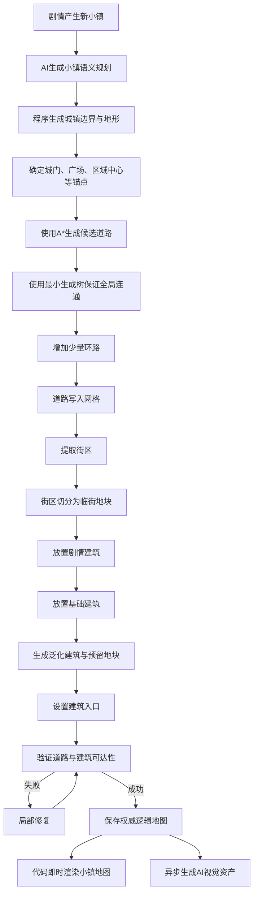
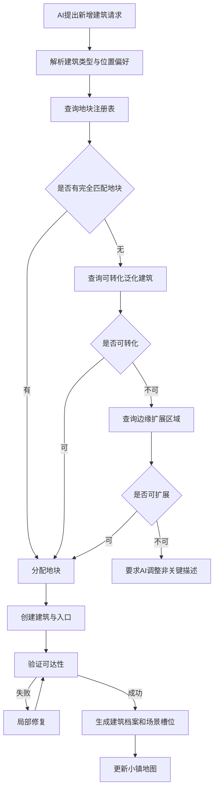

# AI驱动RPG地图层级与小镇程序化生成方案

> 文档版本：v0.1  
> 文档状态：开发设计基线  
> 适用项目：AI驱动单人叙事RPG  
> 重点范围：世界大地图、小镇局部地图、建筑/地点场景、小镇生成算法、动态建筑实例化、图片生成与降级  
> 目标：为后续地图系统、世界状态系统、AI导演系统和资产生成系统提供统一开发依据

---

# 1. 文档目标

本方案用于解决以下问题：

1. 世界大地图上的“地点图标”如何扩展为可探索的小镇局部地图。
2. 小镇内部如何生成道路、街区、地块、建筑和出入口。
3. 如何保证所有可交互建筑都能通过道路抵达。
4. 当剧情只提到少量建筑时，其余建筑如何处理。
5. 后续剧情新增“酒楼”“铁匠铺”“张三家”等地点时，如何合法加入现有小镇。
6. 小镇全貌图、建筑外观图和建筑内部场景图如何生成。
7. 图片生成存在延迟或失败时，游戏如何继续运行。
8. AI与程序规则的职责如何划分。
9. 地图、建筑、NPC和剧情如何保持长期一致。
10. 如何控制MVP复杂度，避免把叙事RPG做成高成本开放世界。

本方案的核心原则是：

> 地图数据是权威事实，图片只是地图数据的视觉表现。

以及：

> AI负责语义规划、命名、描述和视觉创作；程序负责坐标、道路、地块、连通性、合法性和最终状态。

---

# 2. 地图层级设计

游戏空间建议拆分为三个层级：

```text
世界大地图
  ↓
小镇 / 村庄 / 地区局部地图
  ↓
建筑 / 房间 / 特殊区域场景
```

示例：

```text
灰石地区
├─ 白河镇
│  ├─ 镇口
│  ├─ 中心广场
│  ├─ 福来酒楼
│  │  ├─ 酒楼大厅
│  │  ├─ 二楼客房
│  │  └─ 地下酒窖
│  ├─ 张三铁匠铺
│  ├─ 普通民居
│  └─ 尚未明确的建筑
├─ 迷雾森林
└─ 地下矿井
```

## 2.1 世界大地图

世界大地图负责：

- 展示已发现的大型地点。
- 展示地点之间的关系。
- 选择移动目标。
- 计算跨地点移动时间。
- 显示地区危险度、任务状态和世界变化。
- 解锁新城镇、森林、遗迹、矿井等地点。

世界大地图不负责：

- 小镇内部道路。
- 建筑精确位置。
- NPC在镇内的具体移动。
- 建筑内部场景。

## 2.2 小镇局部地图

小镇地图负责：

- 展示道路、街区和建筑位置。
- 允许玩家点击建筑或区域。
- 记录NPC所在建筑。
- 表现昼夜、天气、封路、火灾、袭击等状态。
- 计算镇内移动时间和路径。
- 触发途中事件。
- 保存后续可实例化的地块和泛化建筑。
- 提供建筑入口与道路连通关系。

## 2.3 建筑与场景

建筑场景负责：

- 展示建筑内部或局部环境背景图。
- 显示NPC立绘。
- 执行对话、调查、交易、战斗和任务。
- 保存内部子场景。
- 表现建筑内部状态变化。

示例：

```text
福来酒楼建筑
├─ 大厅：首次进入时生成
├─ 二楼：剧情需要时再生成
└─ 地下酒窖：任务触发后解锁
```

建筑内部不直接放入小镇50×50网格。外部网格只保存建筑占地和入口。

---

# 3. 方案价值与必要性

局部小镇地图不能只是多一层点击。

以下功能至少应实现其中数项，否则不值得增加该系统：

- 玩家建立空间记忆。
- NPC按照日程在建筑间移动。
- 白天和夜晚出现不同NPC与事件。
- 路线被封锁后影响可达性。
- 玩家可以追踪NPC。
- 玩家可以选择绕路或快速移动。
- 移动会消耗世界时间。
- 城镇遭袭时建筑状态在地图上变化。
- 未发现建筑保持未知。
- 调查线索可与空间位置关联。
- 预留建筑位置可供后续剧情使用。
- 建筑之间的相邻关系影响剧情。
- 地图支持潜入、追捕、巡逻和随机遭遇。

---

# 4. 生成策略总览

推荐采用：

# 道路优先、临街地块、延迟实例化

完整流程：



---

# 5. AI与程序职责划分

## 5.1 AI负责

- 小镇主题。
- 小镇规模建议。
- 地区语义。
- 建筑类型需求。
- 剧情必要建筑。
- 建筑偏好位置。
- 建筑名称。
- 建筑描述。
- NPC与建筑关系。
- 视觉风格。
- 环境氛围。
- 图片生成提示。
- 后续新增建筑请求。

## 5.2 程序负责

- 网格尺寸。
- 地形坐标。
- 道路坐标。
- 道路宽度。
- 道路图结构。
- 街区分割。
- 地块边界。
- 建筑占地。
- 建筑入口。
- 建筑是否临街。
- 道路是否连通。
- 建筑是否可达。
- 建筑是否重叠。
- 地块容量。
- 预留位置。
- 路径寻路。
- 地图状态持久化。
- 规则验证。
- 失败修复。

## 5.3 AI不得直接执行

- 指定未经验证的建筑坐标。
- 覆盖现有建筑。
- 删除已发现建筑。
- 修改玩家已确认的道路。
- 在道路或河流上创建建筑。
- 超出地图容量强制创建建筑。
- 让同一NPC同时拥有多个互相矛盾的住所。
- 让玩家已进入的建筑突然改变类型。
- 将图片内容作为地图数据库。

---

# 6. 小镇首次生成时如何处理建筑

当剧情只提到：

> 小镇上有一家酒楼。

不应只生成酒楼和空地图，也不应立刻生成几十栋有完整NPC和故事的建筑。

建议将建筑分为四类。

## 6.1 剧情确定建筑

剧情已经明确提到，首次生成时必须创建。

例如：

- 福来酒楼。
- 张三家。
- 铁匠铺。
- 镇长宅邸。
- 老井。
- 城门。

这类建筑创建后：

- 分配永久建筑ID。
- 分配合法地块。
- 生成入口。
- 保存位置。
- 创建场景槽位。
- 记录与任务和NPC的关系。
- 玩家发现后锁定。

## 6.2 基础功能建筑

即使剧情没有提到，也可生成少量合理建筑：

- 镇门。
- 普通民居。
- 市集。
- 仓库。
- 水井。
- 管理建筑。
- 小型工坊。

基础建筑不一定全部可进入。

## 6.3 泛化建筑

泛化建筑只拥有模糊身份：

- 临街店铺。
- 普通民居。
- 小型工坊。
- 废弃房屋。
- 仓房。
- 院落。

后续剧情需要时，可转化为具体建筑。

例如：

```text
一间临街店铺
→ 回春药铺
→ 生成药铺老板
→ 生成内部背景
→ 开放交易和任务
```

## 6.4 预留地块

预留地块用于未来剧情，不必以“空地”视觉表现。

在地图上可表现为：

- 普通院落。
- 无名建筑。
- 仓房。
- 废屋。
- 未开放街区。
- 被雾遮挡区域。

数据库仍记录其可实例化能力。

---

# 7. 建筑定义状态

建议为建筑和地块建立明确生命周期。

```text
reserved
generic
named
discovered
interactive
visited
story_locked
destroyed
```

含义：

| 状态 | 说明 |
|---|---|
| reserved | 预留地块，尚无正式建筑 |
| generic | 泛化建筑，可后续具体化 |
| named | 已确定名称和类型 |
| discovered | 玩家已在地图发现 |
| interactive | 可点击进入或交互 |
| visited | 玩家已进入 |
| story_locked | 已参与剧情，不允许任意修改 |
| destroyed | 已损毁或失效 |

规则：

- 未发现的泛化建筑可以转化。
- 已发现但未进入的建筑可有限调整内部内容。
- 已访问建筑不能改变位置和基础外观。
- 已参与任务的建筑必须锁定。
- 被摧毁后应保留历史状态，不直接删除。

---

# 8. 网格与空间模型

## 8.1 推荐尺寸

MVP不建议所有小镇固定50×50。

建议：

| 地点类型 | 网格尺寸建议 |
|---|---:|
| 营地 | 12×12至20×20 |
| 小村庄 | 20×20至30×30 |
| 普通小镇 | 32×32至50×50 |
| 大城镇区域 | 40×40至64×64 |
| 大型城市 | 拆成多个区域，不做单张超大地图 |

推荐定义：

```text
1格 = 4米 × 4米
```

50×50表示约200米×200米的小镇核心区。

## 8.2 格子类型

```ts
type TileType =
  | "outside"
  | "grass"
  | "forest"
  | "water"
  | "cliff"
  | "road_main"
  | "road_minor"
  | "alley"
  | "square"
  | "plot"
  | "building"
  | "building_entrance"
  | "reserved";
```

## 8.3 道路图

除网格外，必须保存道路图结构。

```ts
interface RoadNode {
  id: string;
  x: number;
  y: number;
  type: "gate" | "intersection" | "square" | "poi";
}

interface RoadEdge {
  id: string;
  from: string;
  to: string;
  roadType: "main" | "minor" | "alley";
  cells: Array<{ x: number; y: number }>;
  cost: number;
  enabled: boolean;
}
```

用途：

- 判断全局连通。
- 快速寻路。
- 封路。
- NPC移动。
- 计算镇内时间。
- 动态事件影响路径。

---

# 9. 小镇生成算法

本方案推荐使用：

# RFP-Town：Road First Parcel Town Generator

即“道路优先地块生成器”。

---

# 10. 阶段一：AI语义规划

AI不输出最终坐标，只输出语义约束。

示例：

```json
{
  "settlement_type": "small_town",
  "theme": "山间商贸小镇",
  "grid_size": {
    "width": 50,
    "height": 50
  },
  "terrain": {
    "river": "north",
    "hills": "southwest",
    "external_road": "east_to_west"
  },
  "districts": [
    {
      "type": "market",
      "preferred_area": "center_east",
      "weight": 25
    },
    {
      "type": "residential",
      "preferred_area": "west",
      "weight": 45
    },
    {
      "type": "craft",
      "preferred_area": "southwest",
      "weight": 20
    },
    {
      "type": "reserved",
      "preferred_area": "edge",
      "weight": 10
    }
  ],
  "required_buildings": [
    {
      "key": "east_tavern",
      "type": "tavern",
      "preferred_district": "market",
      "preferred_near": [
        "main_road",
        "east_gate"
      ],
      "importance": "story_required"
    },
    {
      "key": "zhang_blacksmith",
      "type": "blacksmith",
      "preferred_district": "craft",
      "preferred_area": "west",
      "importance": "story_required"
    }
  ],
  "required_landmarks": [
    {
      "type": "well",
      "preferred_area": "center"
    }
  ]
}
```

---

# 11. 阶段二：生成地形与城镇边界

先生成：

- 城镇可建造边界。
- 河流。
- 陡坡。
- 森林。
- 城外道路。
- 禁止区域。

MVP建议使用：

```text
基础形状模板 + 种子随机 + 少量噪声扰动
```

例如：

```text
基础形状：椭圆
中心：25,25
半径：22,19
边界扰动：±2格
```

生成以下数据：

```ts
buildableMask[x][y]: boolean;
roadCost[x][y]: number;
buildingCost[x][y]: number;
```

道路代价示例：

| 地形 | 代价 |
|---|---:|
| 已有道路 | 0.4 |
| 平地 | 1 |
| 草地 | 1.2 |
| 森林 | 3 |
| 缓坡 | 4 |
| 河流 | 20，允许建桥时 |
| 陡坡 | 禁止 |
| 建筑 | 禁止 |

---

# 12. 阶段三：生成道路锚点

锚点包括：

- 主城门。
- 次城门。
- 中心广场。
- 市集中心。
- 工坊区中心。
- 住宅区中心。
- 水井。
- 码头。
- 重要建筑附近。
- 关键地标。

锚点约束：

- 位于可建造区域。
- 不在河流或悬崖。
- 锚点间保持最小距离。
- 中心广场接近城镇中心。
- 商业区靠近主路。
- 工坊区远离高档住宅。
- 剧情建筑所在区域必须可接入道路。

---

# 13. 阶段四：A*生成候选道路

对需要连接的锚点执行带权A*。

路径成本：

```text
路径成本 =
移动距离
+ 地形成本
+ 转弯惩罚
+ 坡度成本
+ 河流成本
- 靠近已有道路奖励
```

转弯惩罚用于减少锯齿路。

示意：

```ts
cost =
  terrainCost +
  turnPenalty +
  slopePenalty +
  obstaclePenalty -
  existingRoadBonus;
```

---

# 14. 阶段五：最小生成树保证连通

将锚点作为图节点，A*路径成本作为边权重。

计算最小生成树：

```text
Minimum Spanning Tree
```

作用：

- 所有锚点必然连通。
- 道路数量不过多。
- 不会出现孤立区域。
- 能得到稳定道路骨架。

示意：

```text
东门 ─ 中心广场 ─ 西门
           │
         市集
           │
         工坊区
```

---

# 15. 阶段六：增加环路

最小生成树会导致道路像树枝。

需要补充少量环路，避免：

- 死胡同过多。
- 道路单调。
- 一条主路断开后区域全部不可达。
- 城镇结构不自然。

计算候选边的绕路系数：

```text
绕路系数 =
当前图中两点道路距离
÷ 新直连道路长度
```

当绕路系数超过阈值，例如1.8，可增加支路。

环路比例建议：

| 小镇类型 | 环路比例 |
|---|---:|
| 山村 | 5%至10% |
| 普通小镇 | 15%至25% |
| 商贸小镇 | 25%至40% |
| 规划城市 | 40%以上 |

---

# 16. 阶段七：道路栅格化

将道路图写入网格。

道路宽度建议：

| 道路类型 | 宽度 |
|---|---:|
| 主路 | 3格 |
| 支路 | 2格 |
| 巷道 | 1格 |
| 广场 | 5×5至8×8 |

生成辅助数据：

```ts
roadDistanceMap[x][y];
nearestRoadCell[x][y];
nearestRoadDirection[x][y];
```

---

# 17. 阶段八：提取街区

道路生成后，对所有非道路可建造格执行Flood Fill。

每个连通区域成为候选街区。

```ts
interface Block {
  id: string;
  cells: Cell[];
  area: number;
  roadBoundaryCells: Cell[];
  districtType?: string;
}
```

处理规则：

- 面积太小：绿地、摊位、装饰或并入相邻街区。
- 面积过大：增加支路或再次切分。
- 无临街边界：增加巷道或改为非建筑区域。

---

# 18. 阶段九：临街地块分割

这是防止建筑被其他建筑包围的关键。

每个可建造地块必须满足：

```text
至少有N格边界与道路或巷道相邻
```

MVP建议：

```text
最小临街宽度 = 2格
```

地块生成规则：

1. 识别街区临街边界。
2. 从临街边界向内部切分。
3. 地块深度控制在3至8格。
4. 内部剩余空间：
   - 并入临街地块。
   - 作为庭院。
   - 新增巷道。
   - 作为装饰区域。
5. 禁止生成没有道路接触面的独立建筑地块。

合法性示意：

```text
RRRRRRRRRRRR
R AAA BBB  R
R AAA BBB  R
R CCC DDD  R
RRRRRRRRRRRR
```

其中：

```text
R = 道路
A-D = 临街地块
```

错误情况：

```text
RRRRRRRRRRRR
R AAA BBB  R
R AAA XXX  R
R CCC XXX  R
RRRRRRRRRRRR
```

`XXX`不能作为独立建筑，除非：

- 增加巷道。
- 与相邻地块合并。
- 改成庭院。

地块校验：

```ts
function isValidPlot(plot: Plot, grid: Grid): boolean {
  const frontage = countRoadAdjacentCells(plot, grid);
  const entranceCandidate = hasReachableEntranceCandidate(plot, grid);
  const areaValid =
    plot.area >= plot.minArea &&
    plot.area <= plot.maxArea;

  return frontage >= 2 && entranceCandidate && areaValid;
}
```

---

# 19. 阶段十：建筑放置

建筑按优先级放置：

1. 剧情必要建筑。
2. 基础功能建筑。
3. 泛化建筑。
4. 装饰建筑。
5. 预留地块。

## 19.1 地块评分

示例：酒楼需要：

```json
{
  "building_type": "tavern",
  "minimum_area": 20,
  "preferred_district": "market",
  "required_road_type": [
    "main",
    "minor"
  ],
  "preferred_near": [
    "gate",
    "square"
  ],
  "avoid_near": [
    "cemetery",
    "heavy_industry"
  ]
}
```

评分公式：

```text
地块分数 =
区域匹配
+ 面积匹配
+ 主路邻接
+ 地标距离
+ 剧情位置
- 冲突惩罚
```

示例：

```ts
score =
  districtMatch * 30 +
  areaFit * 20 +
  roadFrontage * 15 +
  landmarkProximity * 15 +
  storyPreference * 25 -
  conflictPenalty;
```

## 19.2 建筑占地

建筑不应填满整个地块。

建议：

```text
建筑占地 = 地块向内缩进1格后的可用区域
```

保留：

- 门前空间。
- 院落。
- 建筑间距。
- 后院。
- 视觉缓冲。

---

# 20. 建筑入口

每栋可交互建筑必须拥有明确入口。

入口必须满足：

```text
建筑入口
→ 门前格
→ 道路或巷道
```

入口不能：

- 开向另一栋建筑。
- 开向河流。
- 开向悬崖。
- 开向不可通行装饰。
- 与道路无路径。

示例：

```ts
const entrance = selectEntranceCell({
  building,
  plot,
  preferRoadType: "main",
  avoidIntersectionDistance: 2
});
```

---

# 21. 全局验证

生成完成后执行两层验证。

## 21.1 道路图验证

从主入口执行BFS或DFS。

必须满足：

- 所有道路锚点可达。
- 所有主要区域中心可达。
- 所有剧情建筑附近道路节点可达。

## 21.2 建筑入口验证

对每栋可交互建筑：

1. 获取建筑入口。
2. 获取门外道路格。
3. 从主城门执行寻路。
4. 确认存在路径。

```ts
function validateBuildingAccess(
  town: Town,
  building: Building
): boolean {
  const gateCell = town.mainGate.walkableCell;
  const entranceRoadCell = getRoadCellOutsideEntrance(building);

  if (!entranceRoadCell) {
    return false;
  }

  return pathExists(
    town.navigationGrid,
    gateCell,
    entranceRoadCell
  );
}
```

---

# 22. 自动修复顺序

发现无效建筑时，不应立即重生成整座小镇。

修复优先级：

1. 改变入口方向。
2. 增加1至3格门前通道。
3. 增加1格宽巷道。
4. 合并相邻地块。
5. 将内部建筑改为庭院或附属建筑。
6. 移动建筑到其他合法地块。
7. 局部重生成失败街区。
8. 更换种子重生成整镇。

建议：

- 单次生成最多局部修复20次。
- 整体重试最多3次。
- 剧情必要建筑失败时必须重试。
- 装饰建筑失败可直接舍弃。

---

# 23. 完整伪代码

```ts
function generateTown(input: TownGenerationInput): Town {
  const rng = createSeededRandom(input.seed);
  const plan = input.semanticPlan;

  const terrain = generateTerrain(plan, rng);
  const townMask = generateTownBoundary(plan, terrain, rng);
  const roadCostMap = buildRoadCostMap(terrain, townMask);

  const anchors = placeAnchors(
    plan,
    townMask,
    terrain,
    rng
  );

  const candidateEdges = calculateAnchorPaths(
    anchors,
    roadCostMap,
    {
      algorithm: "A_STAR",
      turnPenalty: 0.3,
      existingRoadBonus: 0.4
    }
  );

  const backbone = minimumSpanningTree(
    anchors,
    candidateEdges
  );

  const roadGraph = addUsefulLoops(
    backbone,
    candidateEdges,
    {
      maxExtraEdgeRatio: 0.25,
      minDetourRatio: 1.8
    }
  );

  const grid = rasterizeRoadGraph(
    terrain,
    roadGraph,
    {
      mainRoadWidth: 3,
      minorRoadWidth: 2,
      alleyWidth: 1
    }
  );

  let blocks = extractBlocks(grid);

  blocks = assignDistricts(
    blocks,
    plan.districts,
    rng
  );

  let plots: Plot[] = [];

  for (const block of blocks) {
    plots.push(
      ...subdivideIntoFrontagePlots(
        block,
        grid,
        {
          minFrontage: 2,
          minDepth: 3,
          maxDepth: 8,
          allowAlleyInsertion: true
        }
      )
    );
  }

  const requiredBuildings = placeRequiredBuildings(
    plan.requiredBuildings,
    plots,
    grid,
    rng
  );

  const utilityBuildings = placeUtilityBuildings(
    plan,
    plots,
    requiredBuildings,
    rng
  );

  const genericBuildings = placeGenericBuildings(
    plots,
    {
      occupancyRatio: 0.65,
      reservedRatio: 0.2
    },
    rng
  );

  let buildings = [
    ...requiredBuildings,
    ...utilityBuildings,
    ...genericBuildings
  ];

  buildings = buildings.map(building =>
    assignRoadFacingEntrance(building, grid)
  );

  let validation = validateTown({
    grid,
    roadGraph,
    buildings,
    plots
  });

  let repairCount = 0;

  while (!validation.valid && repairCount < 20) {
    repairTownLocally(
      validation.errors,
      grid,
      roadGraph,
      plots,
      buildings
    );

    validation = validateTown({
      grid,
      roadGraph,
      buildings,
      plots
    });

    repairCount++;
  }

  if (!validation.valid) {
    throw new TownGenerationError(
      "Town generation failed after local repairs"
    );
  }

  return {
    seed: input.seed,
    generatorVersion: input.generatorVersion,
    semanticPlan: plan,
    terrain,
    grid,
    roadGraph,
    blocks,
    plots,
    buildings,
    validationReport: validation
  };
}
```

---

# 24. 后续剧情新增建筑

当剧情需要新增建筑，例如：

> 张三住在镇西一座靠近水井的小院中。

处理流程：



## 24.1 降级策略

无法完全满足时按顺序：

1. 使用完全匹配预留地块。
2. 将未发现泛化建筑具体化。
3. 使用最接近位置的合法地块。
4. 在城镇边缘增加扩展街区。
5. 调整剧情中的非关键方位描述。
6. 拒绝建筑请求并重新生成剧情。

不能：

- 覆盖道路。
- 覆盖已发现建筑。
- 让百年老宅突然出现在玩家看过的空地。
- 在没有道路入口的位置强制创建。

---

# 25. 地块注册表

不要只记录“剩余多少格”。

必须记录可用地块的类型和约束。

```json
{
  "plot_id": "plot_craft_02",
  "district": "craft",
  "status": "reserved",
  "allowed_building_types": [
    "blacksmith",
    "workshop",
    "warehouse"
  ],
  "footprint": {
    "x": 31,
    "y": 18,
    "width": 6,
    "height": 5
  },
  "road_access": true,
  "road_type": "minor",
  "nearby_tags": [
    "river",
    "main_road"
  ],
  "restrictions": [
    "no_luxury_residence"
  ]
}
```

系统需要支持查询：

- 可用商业地块数量。
- 可用住宅地块数量。
- 可用工坊地块数量。
- 是否存在大型地块。
- 是否邻近城门。
- 是否邻近水井。
- 是否临近主路。
- 是否适合作为秘密地点。
- 是否已经被玩家观察。

---

# 26. 玩家认知锁定

地图应区分“世界尚未确定”和“玩家已知事实”。

## 26.1 可修改

- 未探索区域。
- 未命名泛化建筑。
- 未使用预留地块。
- 未出现在对话和日志中的内容。
- 玩家尚未看到的建筑内部。

## 26.2 不可随意修改

- 玩家已进入建筑。
- 地图上已显示名称的建筑。
- NPC已明确描述位置的建筑。
- 任务相关建筑。
- 已生成正式背景图的场景。
- 玩家亲眼见过的道路和地标。
- 已发生过战斗或重大事件的位置。

原则：

> 未被玩家认知的内容可以保持柔性；一旦被玩家认知，就成为世界事实。

---

# 27. NPC位置与日程

NPC应绑定建筑和时间段。

```json
{
  "npc_id": "npc_zhang",
  "schedule": [
    {
      "time": "morning",
      "building_id": "building_zhang_blacksmith"
    },
    {
      "time": "evening",
      "building_id": "building_fulai_tavern"
    },
    {
      "time": "night",
      "building_id": "building_zhang_house"
    }
  ]
}
```

移动规则：

- 切换建筑前检查道路可达。
- 道路封锁时调整日程或停留。
- NPC不能瞬间穿越不可达区域。
- 重要NPC可触发途中事件。
- 玩家可在小镇地图看到关键NPC当前位置或模糊线索。

---

# 28. 基础连通与当前连通

生成时连通不代表剧情中始终连通。

必须区分：

```json
{
  "base_reachable": true,
  "currently_reachable": false,
  "blocked_reason": "guard_lockdown"
}
```

可能影响当前连通的事件：

- 道路封锁。
- 桥梁损毁。
- 洪水。
- 火灾。
- 守卫戒严。
- 战斗区域。
- 建筑倒塌。
- 夜间关闭城门。

---

# 29. 空间可达与权限可进入

可走到建筑门口，不代表可以进入。

```json
{
  "spatially_reachable": true,
  "access_state": "locked",
  "unlock_conditions": [
    "has_invitation",
    "night_infiltration"
  ],
  "interaction_state": "available"
}
```

应区分：

- 空间可达。
- 权限允许。
- 剧情允许。
- 当前是否营业。
- 是否已被封锁。
- 是否需要钥匙。
- 是否需要潜入。

---

# 30. 小镇全貌图生成

结论：

> 道路、地块和建筑坐标在同一个逻辑流程生成；小镇全貌图片在逻辑地图成功后再渲染。

不能采用：

```text
AI先生成一张小镇俯视图
→ 再从图片猜道路和建筑
```

原因：

- 图片中的道路可能逻辑不连通。
- 建筑数量与数据库不一致。
- 点击区域不准确。
- 后续无法稳定新增建筑。
- 重生成后坐标变化。
- 图片不能承担寻路和状态更新。

---

# 31. 两套小镇地图视觉

## 31.1 权威逻辑地图

由程序即时渲染。

使用：

- 地形瓦片。
- 道路瓦片。
- 建筑图标。
- 屋顶贴图。
- 河流。
- 树木。
- 任务标记。
- 未探索雾。
- NPC标记。
- 状态特效。

优点：

- 与数据库一致。
- 可点击。
- 加载快。
- 可动态更新。
- 不依赖AI图片。
- 可准确表现封路和损毁。

MVP推荐风格：

```text
俯视或轻等距视角
+ 模块化瓦片
+ 手绘地图质感
```

## 31.2 AI增强全貌图

AI增强图只作为装饰层。

生成流程：

```text
逻辑地图
→ 导出控制图
→ 加入风格描述
→ AI图生图或风格化
→ 保存装饰版全貌图
```

控制图可使用颜色编码：

| 颜色 | 含义 |
|---|---|
| 红色 | 主路 |
| 黄色 | 支路 |
| 蓝色 | 水域 |
| 灰色 | 建筑 |
| 绿色 | 森林 |
| 紫色 | 剧情建筑 |

用途：

- 地图详情背景。
- 章节插图。
- 加载画面。
- 发现新地点时的展示。

交互热区仍来自逻辑数据。

---

# 32. 建筑视觉档案

正式建筑需要共享视觉档案。

```json
{
  "building_id": "building_fulai_tavern",
  "name": "福来酒楼",
  "building_type": "tavern",
  "district": "market",
  "exterior": {
    "floors": 2,
    "roof": "dark_gray_tile",
    "wall": "timber_and_plaster",
    "sign": "red_hanging_sign",
    "frontage_direction": "south",
    "condition": "old_but_busy"
  },
  "surroundings": {
    "road_type": "main_road",
    "nearby": [
      "well",
      "market_stall"
    ],
    "weather": "light_rain"
  },
  "scene_slots": [
    {
      "type": "main_hall",
      "status": "pending"
    },
    {
      "type": "upper_floor",
      "status": "reserved"
    },
    {
      "type": "basement",
      "status": "locked"
    }
  ]
}
```

地图图标、建筑外观、场景背景和文字描述必须引用同一档案。

---

# 33. 图片资产状态机

```ts
type AssetStatus =
  | "not_requested"
  | "queued"
  | "generating"
  | "ready"
  | "failed"
  | "stale";
```

资产记录：

```json
{
  "asset_id": "scene_fulai_tavern_hall_day",
  "asset_type": "scene_background",
  "status": "generating",
  "priority": 90,
  "fallback_asset_id": "template_tavern_hall_01",
  "generation_key": "sha256:example",
  "retry_count": 0
}
```

---

# 34. 图片生成延迟与降级

图片不得阻塞剧情。

降级顺序：

## 第一级：程序地图

小镇全貌永远可以由程序即时渲染。

## 第二级：类型模板图

场景专属图未完成时显示：

- 通用酒楼。
- 普通住宅。
- 铁匠铺。
- 商店。
- 仓库。
- 森林。
- 山洞。
- 矿井。

模板根据：

- 白天或夜晚。
- 晴天或雨天。
- 正常或损毁。
- 富裕或贫困。

选择最接近版本。

## 第三级：局部地图截图

从小镇逻辑地图截取建筑周边：

- 放大。
- 模糊。
- 加暗角。
- 加地点名称。
- 显示NPC立绘。

## 第四级：纯氛围背景

使用：

- 渐变。
- 建筑剪影。
- 地点名称。
- 文字描述。
- 环境音。
- NPC立绘。

玩家仍可正常行动。

---

# 35. 图片生成优先级

| 优先级 | 资产 |
|---|---|
| P0 | 玩家当前场景背景 |
| P0 | 当前核心NPC立绘 |
| P1 | 当前任务建筑外观 |
| P1 | 当前地点关键NPC |
| P2 | 小镇AI增强全貌图 |
| P2 | 新装备图标 |
| P3 | 尚未进入的建筑内部 |
| P4 | 泛化建筑和装饰内容 |

---

# 36. 完整图片生成模拟

假设剧情首次生成白河镇。

## T+0秒

创建：

- 小镇语义规划。
- 小镇ID。
- 地图生成任务。

客户端显示：

```text
发现新地点：白河镇
正在绘制地图……
```

## T+0.1秒

程序完成：

- 50×50逻辑网格。
- 道路。
- 街区。
- 地块。
- 建筑。
- 出入口。
- 寻路图。
- 互动热区。

## T+0.2秒

程序渲染基础小镇地图。

玩家已经可以：

- 查看道路。
- 点击酒楼。
- 查看张三铁匠铺。
- 前往中心广场。
- 查看未知建筑。

## T+0.3秒

后台创建AI资产队列：

```json
[
  {
    "type": "building_exterior",
    "target": "fulai_tavern",
    "priority": 100
  },
  {
    "type": "scene_background",
    "target": "fulai_tavern_main_hall",
    "priority": 100
  },
  {
    "type": "npc_portrait",
    "target": "npc_zhang",
    "priority": 90
  },
  {
    "type": "building_exterior",
    "target": "zhang_blacksmith",
    "priority": 80
  },
  {
    "type": "town_illustration",
    "target": "white_river_town",
    "priority": 30
  }
]
```

## T+1秒

玩家进入酒楼。

专属图未完成：

- 显示通用酒楼模板。
- 叠加“福来酒楼”名称。
- 叠加当前天气。
- 显示NPC立绘。
- 正常进行剧情和对话。

## T+8秒

酒楼大厅图生成完成。

替换策略：

- 当前对话结束后淡入。
- 或下一次进入时使用。
- 不在玩家阅读对白时突然闪切。

## T+15秒

小镇AI增强全貌图完成。

用途：

- 小镇详情。
- 章节介绍。
- 载入界面。

不用于：

- 碰撞。
- 点击定位。
- 寻路。
- 判断建筑存在。

---

# 37. 小镇数据结构

```json
{
  "settlement_id": "town_white_river",
  "name": "白河镇",
  "settlement_tier": "small_town",
  "grid": {
    "width": 50,
    "height": 50,
    "seed": "WR-483927"
  },
  "generator_version": "town-gen-0.1.0",
  "districts": [],
  "roads": [],
  "road_graph": {
    "nodes": [],
    "edges": []
  },
  "plots": [],
  "buildings": [],
  "landmarks": [],
  "entrances": [],
  "capacity": {
    "total_plots": 26,
    "occupied_plots": 14,
    "generic_plots": 6,
    "reserved_plots": 6
  },
  "generation_policy": {
    "reserved_plot_ratio": 0.2,
    "generic_building_mutable_until_discovered": true,
    "allow_edge_expansion": true
  },
  "visual_assets": {
    "logic_map_asset_id": "map_white_river_logic",
    "ai_illustration_asset_id": null
  }
}
```

---

# 38. 建筑数据结构

```json
{
  "building_id": "building_023",
  "plot_id": "plot_market_04",
  "definition_state": "generic",
  "building_type": "commercial_unknown",
  "display_name": "一间临街店铺",
  "district": "market",
  "footprint": {
    "x": 18,
    "y": 22,
    "width": 4,
    "height": 3
  },
  "entrance": {
    "x": 20,
    "y": 25,
    "direction": "south"
  },
  "scene_ids": [],
  "npc_ids": [],
  "player_discovered": false,
  "mutable": true,
  "base_reachable": true,
  "currently_reachable": true,
  "access_state": "open",
  "visual_profile_id": null
}
```

---

# 39. AI新增建筑请求结构

AI只能提交候选请求。

```json
{
  "request_type": "create_building",
  "building_type": "blacksmith",
  "preferred_district": "craft",
  "preferred_area": "west",
  "preferred_nearby_tags": [
    "main_road"
  ],
  "minimum_area": 20,
  "required_for_quest_id": "quest_weapon_repair",
  "narrative_reason": "玩家需要寻找能够修复断剑的铁匠"
}
```

地图系统返回：

```json
{
  "accepted": true,
  "building_id": "building_blacksmith_001",
  "plot_id": "plot_craft_02",
  "resolved_area": "southwest",
  "position_adjusted": true,
  "adjustment_reason": "preferred west plot unavailable"
}
```

---

# 40. 存档与版本

存档必须保存：

- 地图种子。
- 生成器版本。
- 完整地图快照。
- 道路图。
- 地块。
- 建筑。
- 玩家发现状态。
- NPC位置。
- 资产状态。
- 地图变化记录。

示例：

```json
{
  "seed": "WRT-493821",
  "generator_version": "town-gen-0.3.1",
  "map_snapshot": {},
  "created_at_game_version": "0.1.0"
}
```

读取旧存档时使用快照，不按最新版算法重新生成。

---

# 41. MVP实现建议

第一版建议控制范围：

- 24×24至40×40逻辑网格。
- 每镇2至4个区域。
- 8至15个可见建筑。
- 3至5个正式可进入建筑。
- 3至5个预留地块。
- 1条主路。
- 2至5条支路。
- 1至2条巷道。
- 玩家点击建筑自动移动。
- 移动消耗时间。
- NPC只在关键建筑间移动。
- 道路支持简单封锁。
- 程序瓦片地图作为主显示。
- AI场景图异步生成。
- 每类建筑准备模板背景。
- 不实现逐格自由行走。
- 不实现复杂碰撞和角色移动动画。
- 不实现大型城市单图。

---

# 42. 测试要求

## 42.1 生成测试

至少批量生成1000次，验证：

- 主入口存在。
- 主入口能到达中心广场。
- 所有剧情建筑可达。
- 所有互动建筑拥有入口。
- 不存在建筑重叠。
- 不存在建筑覆盖道路。
- 不存在建筑覆盖河流。
- 不存在孤立剧情区域。
- 预留地块满足最低临街要求。
- 同一种子可以重现同一地图。

## 42.2 动态新增建筑测试

测试：

- 商业区有空地。
- 商业区无空地但有泛化建筑。
- 完全没有匹配地块。
- 城镇允许边缘扩展。
- 玩家已经发现全部泛化建筑。
- 新建筑与旧剧情位置冲突。
- 建筑新增后道路仍然可达。
- 新建筑图片失败时正常使用模板。

## 42.3 图片测试

测试：

- AI图片快速完成。
- AI图片长时间排队。
- 图片生成失败。
- 图片返回不符合视觉档案。
- 图片过期。
- 场景状态变化后旧图需要标记stale。
- 模板图切换正式图时不闪屏。
- 无任何图片时纯文本场景仍可运行。

---

# 43. 验收标准

- [ ] 世界大地图可进入小镇局部地图。
- [ ] 小镇地图由程序数据生成。
- [ ] 小镇包含道路、街区、建筑和入口。
- [ ] 所有剧情建筑从主入口可达。
- [ ] 所有可交互建筑至少有一个道路入口。
- [ ] 建筑不会覆盖道路、河流或禁止区域。
- [ ] 建筑不会被其他建筑完全包围。
- [ ] 支持泛化建筑。
- [ ] 支持预留地块。
- [ ] 支持后续剧情新增建筑。
- [ ] 支持玩家认知锁定。
- [ ] 支持基础连通与当前连通。
- [ ] 支持NPC绑定建筑和简单日程。
- [ ] 支持道路封锁。
- [ ] 支持程序即时渲染小镇地图。
- [ ] 支持AI增强全貌图异步生成。
- [ ] 支持建筑场景图异步生成。
- [ ] 图片失败不阻塞剧情。
- [ ] 支持模板背景和纯文本降级。
- [ ] 地图种子和生成器版本可保存。
- [ ] 旧存档不会因算法升级改变地图。

---

# 44. 最终技术结论

该方案可作为AI驱动RPG中长期扩展的空间基础。

推荐实现原则：

1. 世界大地图管理大型地点。
2. 小镇局部地图管理道路、建筑和NPC空间关系。
3. 建筑内部使用独立场景，不嵌入城镇网格。
4. AI生成语义规划，不生成权威坐标。
5. 使用A*连接锚点。
6. 使用最小生成树保证全局道路连通。
7. 增加少量环路改善道路结构。
8. 道路生成后再切街区和地块。
9. 地块必须临街。
10. 建筑入口必须能寻路到主入口。
11. 剧情必要建筑优先放置。
12. 其余建筑使用泛化建筑与预留地块。
13. 后续剧情通过延迟实例化新增建筑。
14. 玩家已知内容必须锁定。
15. 小镇权威地图由程序即时渲染。
16. AI图片只做视觉增强。
17. 图片延迟或失败时使用模板和纯文本兜底。
18. 地图、图片、NPC和剧情必须共用同一结构化档案。

最终流程可概括为：

```text
AI提出小镇语义
→ 程序生成合法道路与建筑布局
→ 保存权威地图
→ 玩家立即可探索
→ AI异步生成地图与场景美术
→ 后续剧情按地块容量继续扩展
```

该方案优先保证：

- 稳定。
- 可达。
- 可扩展。
- 可保存。
- 可验证。
- 不依赖图片生成成功。
- 不允许AI破坏空间规则。
