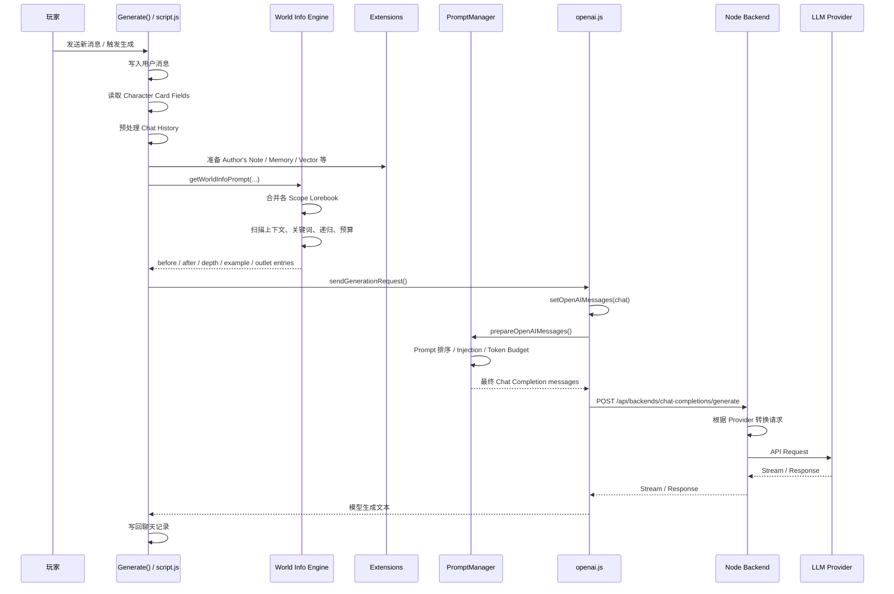
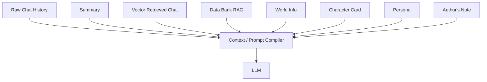
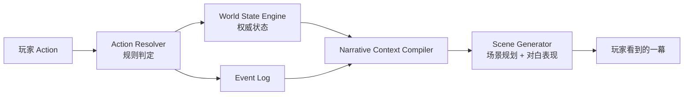
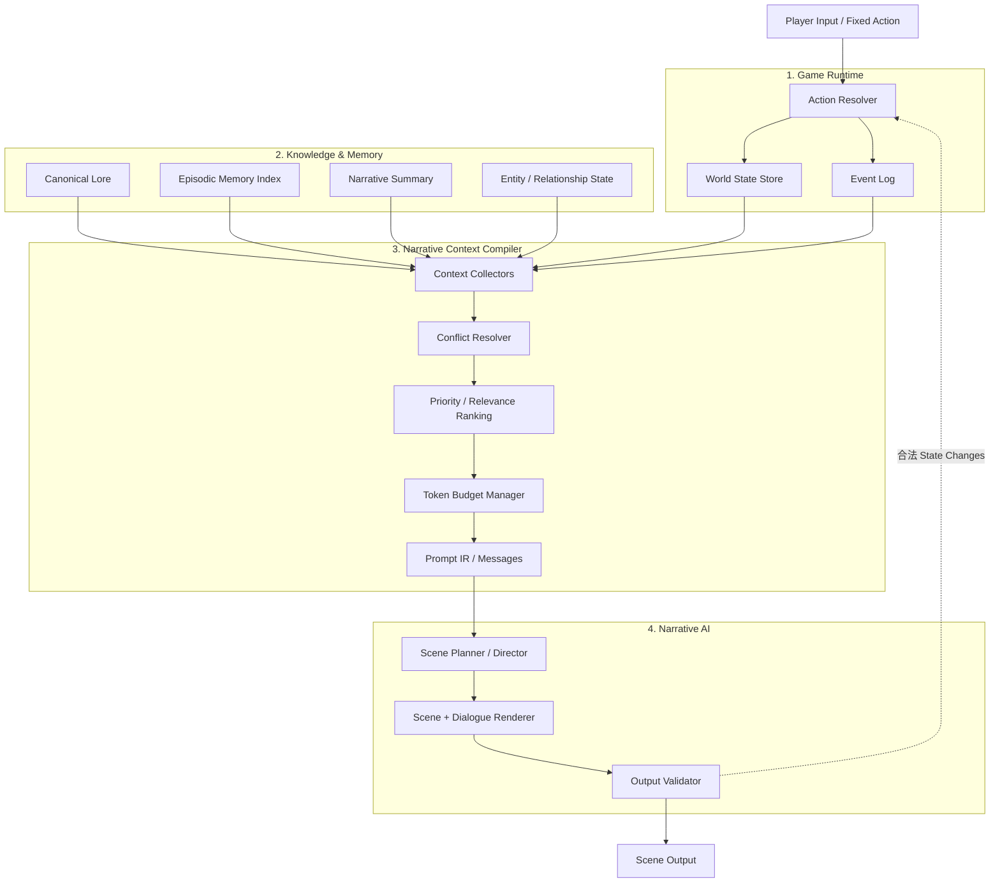

# SillyTavern 源码架构拆解与 AI RPG 剧情系统借鉴

> 调研对象：SillyTavern 官方 GitHub 仓库 `SillyTavern/SillyTavern`
>
> 调研基线：`release` 分支，2026-08-20 读取到的源码
>
> 目的：不是介绍“酒馆怎么用”，而是从源码层面分析它如何组织角色卡、世界书、聊天历史、Prompt、记忆与模型调用，并判断哪些设计适合迁移到本项目的 AI RPG 剧情系统。

---

## 1. 结论先行

SillyTavern（下文简称 ST）最值得研究的地方，不是“角色卡”或“世界书”本身，而是它形成了一套相当成熟的 **Context / Prompt Compilation（上下文编译）机制**：

1. 各种信息先以不同来源独立存在：
   - Character Card
   - Persona
   - Chat History
   - World Info / Lorebook
   - Author's Note
   - Summary Memory
   - Vector Memory
   - Data Bank / Attachments
   - Extensions
2. 在每次生成前，根据当前对话和生成类型动态决定哪些信息应该进入上下文。
3. 把被选中的信息转换成不同优先级、不同角色、不同插入深度的 Prompt 单元。
4. 在上下文 Token 预算内进行排序、裁剪和组装。
5. 最后才把编译后的 Prompt / Messages 交给具体模型后端。

从源码来看，ST 的核心不是“一个大 Prompt 模板”，而更接近：

> **多来源上下文 → 检索/激活 → Prompt 单元化 → 按位置与预算编译 → Provider 适配 → LLM**

这对我们的 AI RPG 很有价值。

但 ST 有一个根本局限：

> **它主要把“世界是什么”表达成文本上下文，而不是一个有强约束的、结构化的、可事务更新的游戏世界状态。**

因此，ST 很适合角色扮演聊天，但不能直接作为 RPG 世界模拟架构照搬。

对我们项目来说，最应该借的是 **Context Compiler / Narrative Context Orchestrator**；最不应该照搬的是 **把 Prompt 当作世界事实本身**。

---

## 2. SillyTavern 到底是什么架构

SillyTavern 本质上是一个本地运行的 LLM 前端和 Prompt 编排系统，而不是一个模型，也不是一个传统意义上的“AI Agent 服务端”。

它的主要职责可以分成三层：

```mermaid
flowchart TB
    U[用户 / UI]

    subgraph FE[浏览器前端：主要编排层]
        CC[Character Card]
        PS[Persona]
        CH[Chat History]
        WI[World Info / Lorebook]
        AN[Author's Note]
        EX[Extensions\nSummary / Vectors / Data Bank]
        GEN[Generate()]
        PM[PromptManager / Context Compilation]
        OA[OpenAI / Text Completion Adapter]

        CC --> GEN
        PS --> GEN
        CH --> GEN
        WI --> GEN
        AN --> GEN
        EX --> GEN
        GEN --> PM
        PM --> OA
    end

    subgraph BE[Node.js 后端]
        API[Express API Endpoints]
        STORE[角色 / 聊天 / 世界书等文件持久化]
        PROXY[模型 Provider 代理与协议转换]
        VECTOR[Vector API]
    end

    subgraph LLM[外部模型与服务]
        P1[OpenAI / OpenRouter]
        P2[Claude / Gemini / Mistral / ...]
        P3[本地 Text Completion Backend]
    end

    U --> FE
    OA --> API
    API --> STORE
    API --> PROXY
    API --> VECTOR
    PROXY --> P1
    PROXY --> P2
    PROXY --> P3
```

### 最重要的架构观察

ST 并不是把所有 Prompt 构建逻辑放到 Node.js 服务端。

实际源码中，大量核心编排发生在浏览器前端：

- `public/script.js` 中的 `Generate()` 是一次生成的主编排入口。
- `public/scripts/world-info.js` 负责世界书扫描、激活、递归、预算和位置分类。
- `public/scripts/PromptManager.js` 定义 Prompt 单元和 Prompt 顺序管理。
- `public/scripts/openai.js` 把 Character、World Info、聊天历史、扩展 Prompt 等最终编译成 Chat Completion Messages。

Node.js 后端则更偏向：

- 文件读取/保存；
- Character Card 格式解析；
- Chat / World Info / Settings 等 API；
- API Key 管理；
- Provider 请求协议转换；
- Streaming 转发；
- Vector 查询；
- 不同 LLM Provider 的统一代理。

这是一种“**前端重编排、后端重持久化和 Provider Adapter**”的结构。

对于我们自己的产品，不建议完全照这个部署边界复制；但它的逻辑分层非常值得参考。

---

## 3. 源码目录中最关键的模块

下面不是完整目录，而是和“AI 剧情生成”直接有关的源码入口。

| 源码位置 | 核心职责 |
|---|---|
| `public/script.js` | 主应用逻辑；`Generate()`；聊天上下文预处理；Character Card 字段提取；World Info 调用；Extension Prompt；生成请求主流程 |
| `public/scripts/openai.js` | Chat Completion Prompt 编译；角色/世界书/聊天历史转 message；Token Budget；生成参数；向后端发送请求 |
| `public/scripts/PromptManager.js` | Prompt 数据结构、Prompt 顺序、启用/禁用、Injection Position、Override 等 |
| `public/scripts/world-info.js` | World Info / Lorebook 加载、扫描、关键词匹配、递归激活、预算、位置分发 |
| `public/scripts/authors-note.js` | Author's Note 相关上下文注入 |
| `public/scripts/extensions/memory/index.js` | Summary Memory：对旧剧情摘要，并重新注入上下文 |
| `public/scripts/extensions/vectors/index.js` | Vector Memory / Data Bank：语义检索历史聊天或文档，然后注入上下文 |
| `src/character-card-parser.js` | 从 PNG Character Card 中读写角色元数据，兼容 V2 / V3 |
| `src/endpoints/chats.js` | Chat JSONL 的保存、读取、导入、备份等 |
| `src/endpoints/characters.js` | Character Card 服务端管理 |
| `src/endpoints/backends/chat-completions.js` | Chat Completion Provider 路由、请求转换、API 转发、Streaming |
| `src/endpoints/backends/text-completions.js` | Text Completion 后端适配 |

这里最值得注意的是：**世界信息、角色信息、记忆信息并没有在数据库里先合成一个“最终上下文对象”**。它们一直保持相对独立，直到生成前才被编译。

---

# 4. 核心数据模型

## 4.1 Character Card：角色不是只有一段人设

在 ST 里，一个 Character Card 是持续参与 Prompt 构建的数据源。

典型角色信息包含：

- Name
- Description
- Personality
- Scenario
- First Message
- Example Messages
- System Prompt
- Post-History Instructions / Jailbreak 类字段
- Character Depth Prompt
- Extensions
- Character-bound World/Lorebook

源码中 `Generate()` 调用 `getCharacterCardFields()` 后，会取得多个独立字段，而不是把整个角色卡作为一段字符串直接塞入 Prompt。

这意味着 ST 的角色卡其实是一组 **可被不同 Prompt Slot 消费的结构化原料**。

### Character Card PNG 只是载体

`src/character-card-parser.js` 的实现也很直接：

- Character 元数据可以嵌入 PNG 的 `tEXt` chunk；
- V2 使用 `chara`；
- V3 使用 `ccv3`；
- 读取时 V3 优先；
- 数据本质仍然是 JSON 文本。

因此“角色卡图片”并不是角色运行时模型，只是一种便携封装格式。

### 对 AI RPG 的启发

我们不应该只有：

```text
NPC.description = 一大段人物设定
```

更合适的是拆开：

```yaml
npc:
  identity: ...
  appearance: ...
  personality: ...
  background: ...
  speech_style: ...
  goals: ...
  secrets: ...
  constraints: ...
```

同时，**动态状态不要写回 Character Card 静态设定**，而应该独立：

```yaml
npc_state:
  hp: 80
  location_id: tavern_01
  attitude_to_player: 35
  current_goal: escape_town
  knows:
    - event_102
    - secret_07
```

这是我们与 ST 应当明显不同的地方。

---

# 5. Chat History：最基础的事件连续性来源

ST 中聊天记录本身就是最直接的短期历史来源。

服务端 `src/endpoints/chats.js` 使用 JSONL 形式管理聊天，消息对象具有类似：

```json
{
  "name": "Character",
  "is_user": false,
  "send_date": "...",
  "mes": "...",
  "extra": {}
}
```

聊天文件第一行还可以包含 `chat_metadata` 等会话级信息。

这带来一个很重要的设计模式：

> **原始历史日志与派生记忆分开。**

原始聊天历史保留，而 Summary、Vector Retrieval 等只是从历史中派生出来的“上下文视图”。

这一点非常适合我们的 RPG，但我们应该进一步强化：

- ST：Chat Message Log
- 我们：Game Event Log + Scene Log + Dialogue Log

在游戏里，真正有价值的不是“模型刚才说过什么”本身，而是发生了什么游戏事件。

例如：

```json
{
  "event_id": "evt_00182",
  "type": "ITEM_TRANSFERRED",
  "actor": "player",
  "target": "npc_blacksmith",
  "item": "ancient_ring",
  "scene_id": "scene_037",
  "timestamp": 483920
}
```

这样的 Event 才应该成为后续世界状态和记忆的底层事实。

---

# 6. 一次生成到底怎么跑：源码级主链路

这是整个 ST 架构最关键的部分。

## 6.1 总流程



---

## 6.2 Step 1：`Generate()` 是总导演

入口在：

```text
public/script.js
Generate(...)
```

`Generate()` 并不是简单调用模型。

它会做很多生成前编排，例如：

1. 处理生成模式；
2. 处理用户新输入；
3. 获取当前 Character Card；
4. 读取角色描述、人格、场景、Example Messages、System Prompt、Depth Prompt 等字段；
5. 预处理当前 Chat；
6. 设置 Extension Prompt；
7. 进行 World Info 扫描；
8. 把 World Info 产生的不同结果映射到不同 Prompt 位置；
9. 最后才进入对应 API 类型的请求构建流程。

所以 `Generate()` 更像一个 **Generation Orchestrator**。

这一点非常值得我们的剧情系统借鉴。

---

## 6.3 Step 2：Character Card 并非一次性拼接

`Generate()` 通过 `getCharacterCardFields()` 获取：

- description
- personality
- persona
- scenario
- mesExamples
- system
- jailbreak
- charDepthPrompt
- creatorNotes

其中 Character Depth Prompt 甚至会进一步通过 Extension Prompt 机制，按指定 depth / role 插进聊天历史中。

也就是说：

> ST 并不把“角色信息”视为一个固定 Prompt Block，而是允许不同角色信息进入不同上下文层级。

这其实已经接近一个小型 Context Compiler。

---

# 7. World Info / Lorebook：真正的实现机制

很多介绍会把 World Info 简单描述成：

> “出现关键词时，把设定插进 Prompt。”

源码看下来，它比这复杂得多。

## 7.1 World Info 有多个 Scope

当前源码会并行收集：

```text
Global Lore
Character Lore
Chat Lore
Persona Lore
```

随后根据配置进行排序。

其中：

- Chat Lore 优先；
- Persona Lore 之后；
- Character Lore 和 Global Lore 的先后可根据 strategy 配置。

因此，World Info 实际上不是一个全局“世界书”，而是一个具有 **Scope + Priority** 的知识注册系统。

### 对我们的启发

可以对应成：

```text
Global World Knowledge
Campaign Knowledge
Region Knowledge
Location Knowledge
Quest Knowledge
Character Knowledge
Player-specific Knowledge
Scene-local Knowledge
```

但需要强调：这些应该是“给 AI 看的知识视图”，而不是游戏权威 State 本身。

---

## 7.2 WorldInfoBuffer：先构造“可扫描上下文”

`world-info.js` 里创建 `WorldInfoBuffer`。

它扫描的不只可以是最近聊天，还可以纳入额外来源，例如：

- Persona Description
- Character Description
- Character Personality
- Character Depth Prompt
- Scenario
- Creator Notes
- 允许参与 World Info Scan 的 Extension Prompt

这说明 World Info 激活机制本质是：

> **先构造一个 Retrieval Query Context，再根据这个 Context 激活知识。**

这比“只扫描玩家最后一句话”明显更强。

---

## 7.3 激活方式

源码 `checkWorldInfo()` 的主要判断包括：

### 1. Constant Entry

无需关键词，总是激活。

### 2. Primary Keywords

主关键词命中则进入下一步。

### 3. Secondary Keywords

可以配合不同逻辑继续判断，例如：

- AND ANY
- AND ALL
- NOT ANY
- NOT ALL

### 4. Generation Trigger Filter

某条 World Info 可以只在特定生成类型下生效。

### 5. Character / Tag Filter

可以限制条目只对某些 Character 生效，或者排除某些 Character。

### 6. Sticky / Cooldown / Delay

World Info 不是每次都简单重新判断，它还支持带时间性的激活控制：

- Sticky
- Cooldown
- Delay

### 7. Probability

条目可设置概率激活。

### 8. External Activation

其他模块也可以主动让某个条目进入激活状态。

这已经不是一个简单的“关键词词典”，更像一个轻量 **Rule-based Context Retrieval Engine**。

---

# 8. World Info 的递归激活

这是 ST 一个很有意思的机制。

第一次扫描得到的 World Info 内容，还可以继续成为下一轮 World Info 扫描的一部分，从而触发新的条目。

例如：

```text
当前聊天出现：银月城
        ↓
激活：银月城属于北方联盟
        ↓
新文本中出现：北方联盟
        ↓
再次激活：北方联盟正在和帝国交战
```

源码里通过 scan state / recursion loop 实现，并支持：

- 最大递归步数；
- `preventRecursion`；
- `excludeRecursion`；
- `delayUntilRecursion`。

### 对 AI RPG 的价值

这个思路可以借，但不要直接把它用来推导“真实世界状态”。

适合用来做：

- 找相关背景资料；
- 自动补足势力信息；
- 补充地点上下级关系；
- 补充 NPC 所属组织；
- 找当前事件相关历史。

不适合用来决定：

- NPC 现在是否死亡；
- 门是否已打开；
- 某件物品当前归谁；
- 任务是否完成；
- 玩家是否拥有 1000 金币。

这些必须查询权威 Game State。

---

# 9. World Info 的 Token Budget

ST 对 World Info 并不是“命中多少塞多少”。

源码会根据最大上下文计算一个 World Info Budget：

```text
budget = world_info_budget_percent × maxContext
```

同时还有 budget cap。

命中的条目会继续经过排序、概率判断和 Token 预算判断；超过预算后普通条目不会继续进入 Prompt。

这意味着 ST 的世界知识系统已经有明确的：

> **Retrieval → Ranking → Budgeting**

这和现代 RAG / Context Engineering 的思想非常接近。

### 对 AI RPG 的启发

我们的 Context Compiler 必须从第一天就有 Token Budget，而不是开发后期再做压缩。

建议按类别预留预算，而不是所有东西抢一个池子：

```yaml
context_budget:
  system_rules: 10%
  current_scene: 20%
  authoritative_state: 20%
  active_characters: 15%
  relevant_events: 15%
  retrieved_lore: 10%
  recent_dialogue: 10%
```

实际比例后续可调，但“分槽预算”这个理念应该保留。

---

# 10. World Info 不只可以插在 Prompt 前后

这是理解 ST Prompt 系统的重要一点。

World Info 激活后会根据 `position` 被拆到不同位置，包括类似：

- World Info Before
- World Info After
- Example Messages Top / Bottom
- Author's Note Top / Bottom
- At Depth
- Outlet

其中 At Depth 表示：

> 可以把某条信息插到聊天历史内部某个深度，而不是统一放 System Prompt 最前面。

例如：

```text
System
Character Description
World Info Before
...
Chat message -5
Chat message -4
[某个 Depth Prompt]
Chat message -3
Chat message -2
Chat message -1
Current User Message
```

这背后隐含了一个很重要的观点：

> **上下文中的“位置”本身就是语义和权重。**

对于我们的 RPG，这个思想值得保留，但应该把位置抽象成更业务化的 Slot，而不是暴露成纯数字 depth。

例如：

```text
SYSTEM_RULES
WORLD_CANON
CURRENT_STATE
SCENE_SETUP
CHARACTER_PRIVATE_CONTEXT
RELEVANT_MEMORY
RECENT_EVENTS
RECENT_DIALOGUE
PLAYER_ACTION
OUTPUT_CONTRACT
```

这样比“depth = 4”更容易维护。

---

# 11. PromptManager：ST 真正值得借鉴的核心

`public/scripts/PromptManager.js` 定义了 Prompt 的基本抽象。

一个 Prompt 不只是 content，它还具有类似：

```text
identifier
role
content
name
system_prompt
position
injection_position
injection_depth
injection_order
forbid_overrides
extension
```

这说明 ST 的 Prompt 已经被当作“编译单元”处理，而不是字符串拼接。

## 11.1 Prompt Source

PromptManager 知道多个固定来源，例如：

- charDescription
- charPersonality
- scenario
- personaDescription
- worldInfoBefore
- worldInfoAfter

另外还有系统 Prompt：

- main
- jailbreak
- enhanceDefinitions 等

### 本质

可以把 PromptManager 理解成：

```text
Prompt AST / Prompt IR + Prompt Order + Prompt Injection Rules
```

也就是一个非常轻量的 Prompt Intermediate Representation。

这比我们在代码里写：

```ts
const prompt = system + world + npc + history + action
```

要成熟很多。

---

# 12. Chat Completion 路线：Prompt 是怎样最终编译的

对于 OpenAI-style Chat Completion，核心在：

```text
public/scripts/openai.js
```

主要流程可以概括成：

```mermaid
flowchart LR
    A[Raw Chat] --> B[setOpenAIMessages]
    B --> C[Chat roles/messages]

    P[Prompt Sources] --> D[prepareOpenAIMessages]
    C --> D

    D --> E[preparePromptsForChatCompletion]
    E --> F[populateChatCompletion]
    F --> G[Token Budget / Injection]
    G --> H[Final messages[]]
    H --> I[createGenerationParameters]
    I --> J[sendOpenAIRequest]
```

## 12.1 `setOpenAIMessages()`

负责把聊天记录转成 API 所需的 role/message 结构，例如：

- user
- assistant
- system

Narrator 等特殊消息也会做对应处理。

## 12.2 `prepareOpenAIMessages()`

这里创建 Chat Completion 上下文，并给它上下文预算：

```text
max context
max output tokens
```

随后准备各种 Prompt，执行真正的上下文编译。

## 12.3 `populateChatCompletion()`

会把各类 Prompt 逐步加入 Chat Completion，包括：

- worldInfoBefore
- main prompt
- worldInfoAfter
- charDescription
- charPersonality
- scenario
- personaDescription
- extension/in-chat prompts
- example messages
- actual chat history

同时不断占用 Token Budget。

### 一个非常值得借的设计

ST 不只是“最后 Token 太长了再截断”。

它在 Prompt Population 过程中就持续考虑预算。

也就是说：

> **Token Budget 是 Context Compiler 的一等公民。**

我们的 RPG 也应该这样做。

---

# 13. Text Completion 与 Chat Completion 是两套编译路线

ST 并不假设所有模型都是 OpenAI Chat Completion 格式。

大体可以理解为：

### Chat Completion

使用：

- PromptManager
- role-based messages
- `openai.js`

### Text Completion

使用：

- Story String
- Instruct Mode
- Text Completion formatting

这体现出一个很好的架构边界：

> **“剧情上下文是什么”与“最终模型协议需要什么格式”是两个问题。**

这对我们非常重要。

我们以后可能使用：

- OpenAI
- Claude
- Gemini
- 开源模型
- 专门的剧情规划模型
- 专门的对白模型

所以应该先生成统一的内部 `NarrativeContext`，再由 Provider Adapter 转换为不同模型格式。

---

# 14. 后端到底做什么

`src/endpoints/backends/chat-completions.js` 提供统一的 `/generate` 路由。

前端最终会请求：

```text
POST /api/backends/chat-completions/generate
```

服务端随后根据 `chat_completion_source` 分发到不同 Provider，例如不同 Chat Completion 服务，再执行：

- 参数转换；
- Header / API Key；
- JSON Schema 兼容处理；
- Provider 特有字段；
- Prompt Post-processing；
- Streaming 转发；
- 响应适配。

所以它更像：

```text
LLM Gateway / Provider Adapter
```

而不是剧情编排核心。

### 对我们的项目

我们的 Next.js 服务端完全可以承担：

```text
Narrative Orchestration
+ Game State
+ Context Compiler
+ LLM Gateway
```

没有必要像 ST 一样把大量剧情 Prompt 编排放浏览器。

对于多人、反作弊、规则一致性、未来 Steam/Web 共用后端等需求，**我们的权威剧情逻辑应该在服务端**。

---

# 15. SillyTavern 的“记忆系统”其实不是一个系统

这是这次源码分析里最重要的发现之一。

ST 没有一个统一的：

```text
MemoryService
```

来决定所有长期记忆。

实际上它是几种机制并列存在。

---

## 15.1 Recent Chat History：原始短期记忆

最近的聊天记录直接进入上下文。

优点：

- 信息完整；
- 不需要摘要；
- 不会因为检索漏掉。

缺点：

- Token 成本线性增加；
- 最旧消息最终会被挤出去。

---

## 15.2 Summary Memory：压缩记忆

内置 memory/summarize 扩展会对历史内容进行摘要。

源码里的 `setMemoryContext()` 会：

1. 把摘要通过 `setExtensionPrompt()` 注入上下文；
2. 把摘要保存到某条 Chat Message 的：

```text
message.extra.memory
```

也就是说 Summary Memory 本质是：

> **派生摘要 + Prompt Injection**

它不是权威事实数据库。

风险也非常明显：

- 摘要可能丢细节；
- 摘要可能把推测写成事实；
- 多次滚动摘要可能累计偏差。

对于纯聊天，这可以接受；对于 RPG 规则状态，不能接受。

---

## 15.3 Vector Memory：语义检索过去聊天

`public/scripts/extensions/vectors/index.js` 会：

1. 对历史聊天建立向量索引；
2. 根据当前聊天构造查询文本；
3. 调用 `/api/vector/query`；
4. 找到最相关的旧消息；
5. 从普通 Chat History 队列中移出这些消息；
6. 格式化成“相关过去消息”；
7. 通过 `setExtensionPrompt()` 在指定位置重新插入。

这不是简单“搜索一下然后追加”。

它实际上把：

```text
chronological context
```

转换成部分：

```text
semantic context
```

### 对 RPG 很有价值

例如当前进入“铁匠铺”，系统可以检索：

- 玩家第一次见铁匠时发生的事；
- 玩家之前是否帮助过他；
- 玩家是否答应找某件矿石；
- NPC 与玩家过去的关键冲突。

但检索到的信息仍然只是 **Narrative Memory**，不能取代权威关系值和任务状态。

---

## 15.4 Data Bank：文档 RAG

Vector 扩展同样可以对文件切块和向量化，再按当前上下文检索相关文档 Chunk。

这就已经接近标准 RAG：

```text
Document
  ↓ chunk
Embedding Index
  ↓ query
Relevant Chunks
  ↓
Extension Prompt
```

这适合我们未来承载：

- 大世界背景设定；
- 地区资料；
- 神话传说；
- 阵营历史；
- 书籍内容；
- 非结构化剧情资料。

---

# 16. SillyTavern 记忆架构的真正模型

把所有东西放在一起，可以得到这个模型：



换句话说：

> SillyTavern 不试图把所有记忆融合成一份“大记忆”。
>
> 它允许多个记忆提供者并存，最后在生成时统一竞争 Prompt 空间。

这个设计思想非常值得我们借。

---

# 17. SillyTavern 架构为什么在角色扮演里有效

## 17.1 内容来源彼此解耦

角色卡不知道 Vector Memory 怎么工作。

World Info 也不需要知道 Summary 如何生成。

最后统一走 Context / Prompt Compilation。

这降低了耦合。

---

## 17.2 Prompt 不是一个字符串，而是很多有位置的单元

这是整个系统可扩展的基础。

否则每增加一个功能都只能：

```text
prompt += xxx
```

最终必然失控。

---

## 17.3 Scope 做得比较好

Global / Character / Chat / Persona 各自有 Lore Scope。

这允许同一套系统在不同角色、不同聊天中复用。

---

## 17.4 Retrieval 与 Token Budget 是显式机制

不是把“所有设定”都发送给模型，而是：

```text
Select → Rank → Budget → Inject
```

这对任何长期 AI RPG 都是必要的。

---

## 17.5 Provider 与剧情上下文相对分离

同一套角色和世界信息可以送到不同模型。

模型层不是剧情数据层。

---

# 18. 但它为什么不能直接成为我们的 RPG 剧情架构

这里是最重要的分界线。

## 18.1 World Info 是“给模型看的知识”，不是 World State

例如：

```text
“国王还活着。”
```

如果它只是 World Info 文本，那么之后剧情中玩家杀死国王，就必须人工或其他逻辑去修改对应设定，否则旧信息仍可能被检索出来。

真正的 RPG 应该是：

```json
{
  "entity_id": "king_01",
  "alive": false
}
```

然后 Context Compiler 根据当前 State 生成：

```text
国王已经死亡。
```

**State 是源，Prompt 是派生物。**

而不是相反。

---

## 18.2 ST 缺少强规则的状态转移层

聊天里模型说：

```text
“我把 10000 金币给你。”
```

ST 并不会天然检查：

```text
NPC 有没有 10000 金币？
这个行为是否允许？
玩家 Inventory 是否增加？
是否触发任务事件？
```

而我们之前已经确定：

> 玩家输入和 AI 提议都不能直接修改事实；必须经过游戏规则决定行动是否成立。

所以我们的 RPG 必须有一个 ST 没有的核心：

```text
Action Resolution / State Transition Engine
```

---

## 18.3 Summary Memory 不能作为 RPG 事实

例如摘要模型错误写成：

```text
“玩家已经杀死狼人首领。”
```

如果游戏真实状态里狼人首领还活着，就产生严重冲突。

因此我们要定义：

```text
Authoritative State > Event Log > Narrative Memory > Generated Text
```

优先级必须不可逆。

---

## 18.4 Vector Recall 只保证“相关”，不保证“正确和当前”

Vector Retrieval 可能找到三小时前的旧事件：

```text
NPC 当时住在城西。
```

但当前状态已经搬到城东。

所以检索的旧事件只能作为：

```text
Historical Context
```

不能覆盖：

```text
Current State
```

---

## 18.5 过度依赖自由文本会让冲突解析越来越困难

当 Character Card、World Info、Summary、Vector Memory 都在描述同一个事实时，Prompt 中可能出现冲突。

LLM 会自行判断，但 RPG 不能把关键游戏规则交给模型“猜哪个是真的”。

---

# 19. 对我们现有 AI RPG 的直接启发

我们现在已有两大剧情模块：

1. **World State / 整体世界状态变化**
2. **Scene Generation / 根据玩家选择生成每一幕和对白**

看完 ST 后，我认为中间缺少一个非常明确的第三层：

# **Narrative Context Compiler（叙事上下文编译器）**

也可以叫：

```text
Context Orchestrator
Narrative Context Builder
Story Context Compiler
```

我更推荐 `Narrative Context Compiler`。

---

# 20. 我们应该变成三层，而不是两层



原来的两块并没有错，只是中间缺了 Context Compilation。

它负责回答：

> **“为了生成这一幕，AI 到底应该知道什么？”**

而不是让 Scene Generator 自己去数据库里到处抓东西。

---

# 21. 推荐的 RPG Context Layer

参考 ST，但根据游戏需要改造后，我建议至少分成以下层。

## Layer 0：Game Rules

最高优先级，固定规则，例如：

- Action 能做什么；
- 战斗规则；
- 物品规则；
- 世界边界；
- 输出 Schema；
- AI 不允许自行创建哪些事实。

---

## Layer 1：Canonical World Knowledge

相对静态的世界设定：

- 世界背景；
- 种族；
- 国家；
- 地理；
- 历史；
- 魔法规则。

这一层最接近 ST World Info / Data Bank。

可以使用关键词 + Embedding Retrieval。

---

## Layer 2：Authoritative Current State

这是我们的核心，ST 没有真正提供。

例如：

```json
{
  "location": "town_003/tavern_01",
  "time": "day_7_21:20",
  "weather": "rain",
  "npc_present": ["npc_12", "npc_19"],
  "quest_state": {
    "quest_07": "ACTIVE"
  }
}
```

此层永远优先于文本记忆。

---

## Layer 3：Entity Context

当前幕涉及角色的：

- Static Profile；
- Dynamic State；
- Relationship；
- Goals；
- Knowledge / Secrets；
- Current Emotion；
- Recent relevant events。

这相当于 Character Card 的升级版。

---

## Layer 4：Episodic Memory

像 ST Vector Memory 一样，按当前场景检索过去相关事件。

例如：

```text
NPC 曾经被玩家救过
玩家三天前骗过该商人
这个酒馆曾发生过一次斗殴
```

底层来源应当优先来自 Event Log，而不是模型自由文本。

---

## Layer 5：Recent Scene Context

保留最近几幕的完整上下文：

- 最近 Dialogue；
- 最近 Action；
- 当前 Scene Goal；
- 正在进行的 Interaction。

避免每个回合都只靠摘要。

---

## Layer 6：Narrative Guidance

类似 ST Author's Note，但应该由我们的剧情规划器产生：

- 当前剧情目的；
- 这一幕的戏剧功能；
- 节奏；
- 不能提前揭露的信息；
- 应该埋的伏笔；
- 可选冲突方向。

这不是世界事实，而是“导演指令”。

---

# 22. 推荐的数据优先级

任何时候出现冲突，都应该按以下优先级处理：

```text
1. Game Rules
2. Authoritative Current State
3. Canonical Entity Data
4. Event Log
5. Current Quest / Scene Plan
6. Retrieved Episodic Memory
7. Summaries
8. Generated Narrative Text
```

这会解决 ST 在 RPG 场景中最危险的问题：

> 多个 Prompt 来源相互矛盾时，把决定权交给 LLM。

我们不能这样做。

---

# 23. 我们应该借鉴 ST 的 Prompt Slot，而不是复制它的 Prompt 文本

推荐内部定义：

```ts
type NarrativeContextSlot =
  | 'SYSTEM_RULES'
  | 'WORLD_CANON'
  | 'CURRENT_STATE'
  | 'LOCATION_CONTEXT'
  | 'ACTIVE_QUESTS'
  | 'CHARACTER_CONTEXT'
  | 'RELATIONSHIP_CONTEXT'
  | 'RELEVANT_EVENTS'
  | 'RECENT_SCENES'
  | 'DIRECTOR_GUIDANCE'
  | 'PLAYER_ACTION'
  | 'OUTPUT_CONTRACT';
```

每个 Slot 定义：

```ts
interface ContextBlock {
  id: string;
  slot: NarrativeContextSlot;
  content: string;
  priority: number;
  tokenCost: number;
  sourceType: 'state' | 'event' | 'lore' | 'memory' | 'director';
  sourceIds: string[];
  authoritative: boolean;
  expiresAt?: number;
}
```

然后由 Context Compiler 统一：

```text
Collect
→ Resolve Conflict
→ Rank
→ Budget
→ Render
→ Provider Adapter
```

这是我们最应该从 ST 学到的东西。

---

# 24. 我们的完整目标架构



这里有一条必须坚持的原则：

> **LLM 输出不能直接写 World State。**

如果 AI 认为剧情需要：

```text
NPC 加入队伍
NPC 死亡
获得物品
新地点出现
任务完成
```

它应该输出 Proposal / Action / Event Candidate，再由游戏规则层批准。

这正好和我们之前已经确定的设计方向一致。

---

# 25. SillyTavern 世界书对应到我们项目应该变成什么

不要直接做一个叫 `world_info` 的大表。

应该拆成两类。

## A. Canonical Lore Registry

负责相对静态的非结构化知识：

```text
“银月王国建立于第三纪元……”
“精灵通常寿命超过五百年……”
“黑森林北部存在古代遗迹……”
```

可以使用：

- Scope；
- Tag；
- Keyword；
- Embedding；
- Priority；
- Token Budget。

这部分可以高度借鉴 ST World Info。

## B. World State Store

负责当前事实：

```text
king_01.alive = false
bridge_04.destroyed = true
npc_08.location = town_2
quest_11.state = completed
player.gold = 370
```

这部分绝对不要放进 Lorebook 里靠文本维护。

---

# 26. SillyTavern Character Card 对应到我们项目应该怎么拆

ST：

```text
Character Card
```

我们的 RPG 建议变成：

```text
CharacterDefinition        // 静态
CharacterRuntimeState      // 动态
CharacterRelationship      // 对不同实体关系
CharacterKnowledgeState    // 角色知道什么
CharacterMemoryIndex       // 重要经历
CharacterNarrativeProfile  // 给生成模型的表达偏好
```

例如：

```yaml
CharacterDefinition:
  id: npc_anna
  name: Anna
  personality: cautious
  occupation: apothecary

CharacterRuntimeState:
  location: town_01/shop_02
  hp: 72
  current_goal: find_missing_sister
  mood: anxious

CharacterRelationship:
  player:
    affinity: 43
    trust: 22
    relationship_stage: acquaintance

CharacterKnowledgeState:
  knows:
    - evt_104
    - secret_bandit_route

CharacterNarrativeProfile:
  speaking_style: short_and_reserved
  taboo_topics:
    - sister
```

这样一来，同一个 NPC 的“人设”和“当前发生了什么”不会混在一大段 Prompt 里。

---

# 27. 关于伙伴 / 好感度系统，也能从这个架构受益

我们之前讨论过伙伴、好感度以及 NPC 在主线中停留时间不长的问题。

采用 Context Compiler 后，关系不需要靠“聊天历史里记得玩家对她很好”来判断。

应该明确存：

```json
{
  "npc_id": "npc_anna",
  "relationship": {
    "affinity": 42,
    "trust": 30,
    "fear": 0,
    "relationship_stage": "ally_candidate"
  }
}
```

同时把真正导致变化的事件保留：

```text
+10 trust because player protected Anna in evt_137
-5 affinity because player insulted her in evt_141
```

生成下一幕时：

- State 提供当前数值；
- Event Retrieval 提供最近关键原因；
- Scene Generator 把它自然表现成对白和行为。

这比让 LLM 从几十轮聊天里自己猜“现在好感度大概多少”可靠得多。

---

# 28. 一个具体例子：玩家再次遇见铁匠

假设当前玩家进入铁匠铺。

## SillyTavern 式思路

可能会组合：

```text
Character Description: 铁匠的人设
World Info: 城镇 / 铁匠铺背景
Vector Memory: 上一次和铁匠相关的聊天
Chat History: 最近对话
Author's Note: 当前剧情指导
```

然后模型自行综合。

## 我们应该做的版本

### Step 1：从权威 State 取得

```text
铁匠还活着
当前位置 = forge_01
与玩家 trust = 65
quest_sword = ACTIVE
玩家拥有 rare_ore = true
```

### Step 2：从 Event Log 检索

```text
evt_044 玩家从山贼手中救过铁匠
evt_072 铁匠拜托玩家寻找稀有矿石
```

### Step 3：从 Lore 检索

```text
这种稀有矿石可以锻造冰属性武器
```

### Step 4：Scene Director 给出目的

```text
本幕应推进 quest_sword；
铁匠先感谢玩家，再发现玩家已经取得矿石；
不要直接完成锻造，需要进入制作阶段。
```

### Step 5：Scene Generator 才生成对白

这时 AI 才负责“怎么演”。

这就是我们和 ST 的核心差别：

> ST 主要解决“模型应该看到什么”；
>
> 我们还必须在此之前解决“世界真实发生了什么”。

---

# 29. 对当前剧情系统的重构建议

不需要推倒现在的两大模块。

建议按下面顺序渐进式增加。

## Phase 1：先加 Context Compiler

保持现有：

```text
World State Module
Scene Generation Module
```

在中间增加：

```text
Narrative Context Compiler
```

先把所有给 Scene AI 的 Prompt 来源收口。

目标：以后任何模块都不能自己直接 `prompt += xxx`。

---

## Phase 2：建立统一 Event Log

所有真正发生的游戏事件统一落 Event。

例如：

```text
NPC_MET
NPC_JOINED
NPC_LEFT
RELATION_CHANGED
ITEM_GAINED
ITEM_LOST
BATTLE_STARTED
BATTLE_ENDED
QUEST_STARTED
QUEST_ADVANCED
QUEST_COMPLETED
LOCATION_DISCOVERED
WORLD_FACT_CHANGED
```

Event Log 既是审计记录，也是长期记忆的原材料。

---

## Phase 3：增加 Episodic Memory Retrieval

参考 ST Vector Memory，但检索对象优先是：

```text
Event + Scene Summary
```

而不是所有原始对白。

这样更稳定、更便宜。

---

## Phase 4：把 Scene Generation 再拆成 Planner + Renderer

如果后续剧情复杂度上升，可以从：

```text
Context → 直接生成一幕
```

升级为：

```text
Context
  ↓
Scene Planner
  ↓ structured scene plan
Scene / Dialogue Renderer
  ↓
玩家看到的内容
```

这样 Planner 决定“发生什么”，Renderer 决定“怎么表现”。

---

# 30. 最终建议：哪些直接借，哪些不要借

| SillyTavern 设计 | 是否建议借 | 我们的改造方式 |
|---|---:|---|
| Character Card 分字段 | 强烈建议 | 拆成 Character Definition + Runtime State + Relationship + Knowledge |
| World Info 多 Scope | 强烈建议 | Canonical Lore / Region / Quest / Character / Scene Scope |
| Keyword Activation | 建议 | 用于 Lore Retrieval，不用于 World State |
| Recursive Lore Activation | 有条件建议 | 用于扩展相关背景，不得修改权威事实 |
| Prompt Injection Position | 强烈建议 | 改造成业务化 Context Slot |
| PromptManager | 强烈建议 | 实现 Narrative Context Compiler / Prompt IR |
| Token Budget | 必须借 | 每种 Context 类型有预算与优先级 |
| Recent Chat | 建议 | 变成 Recent Scene / Dialogue Context |
| Summary Memory | 有条件建议 | 只做叙事压缩，不做事实来源 |
| Vector Memory | 强烈建议 | 主要检索 Event / Scene Summary |
| Data Bank RAG | 建议 | 存大世界非结构化 Lore |
| Prompt 作为主要世界状态 | 不建议 | Structured World State 才是 Source of Truth |
| LLM 自行判断状态变化 | 不建议 | Action Resolver / State Transition 决定 |
| 大量前端编排 | 不建议直接复制 | 我们放服务端保持权威性 |
| Provider Adapter | 建议 | Context 与模型协议解耦 |

---

# 31. 一句话定义 SillyTavern 的核心

如果只用一句架构语言概括 SillyTavern：

> **SillyTavern 是一个以角色扮演为目标的、多来源动态上下文编译器，加上一套 LLM Provider Gateway 和内容管理 UI。**

它最成熟的不是“记忆”，而是：

> **如何在每一次生成前，从很多可能的信息源中挑出当前最有用的信息，并在 Token 预算内按正确位置组装给模型。**

---

# 32. 一句话定义我们应该从它演化出的架构

我们的 AI RPG 不应该成为：

```text
SillyTavern + 地图 + 战斗
```

而应该是：

```text
Deterministic Game State / Rules
        +
Event-sourced World Memory
        +
SillyTavern-like Context Compilation
        +
AI Scene Planning / Rendering
```

即：

> **游戏规则和结构化状态负责“真相”，Context Compiler 负责“AI 此刻知道什么”，生成模型负责“这一幕怎么演”。**

这是我认为 SillyTavern 对我们当前剧情架构最有价值的借鉴。

---

# 33. 后续落地时建议新增的核心模块

如果下一步开始进入我们自己的 Spec，我建议直接增加下面几个正式模块：

```text
/game-state
  WorldStateStore
  EntityStateStore
  RelationshipStateStore

/events
  GameEventLog
  EventProjector

/knowledge
  LoreRegistry
  LoreRetriever

/memory
  EpisodicMemoryIndexer
  EpisodicMemoryRetriever
  SceneSummarizer

/narrative-context
  ContextCollector
  ConflictResolver
  ContextRanker
  TokenBudgetManager
  PromptRenderer

/narrative
  ScenePlanner
  SceneRenderer
  NarrativeValidator

/llm
  LLMGateway
  ProviderAdapters
```

其中第一优先级不是 Memory，而是：

```text
Narrative Context Compiler
```

因为只要这个层先建立起来，后续 Character Memory、World Lore、伙伴关系、任务信息、地点资料、战斗结果等所有信息源都可以通过统一接口逐步接入，而不需要反复修改 Scene Prompt。

---

# 34. 关键源码索引

> 下面均为 SillyTavern 官方仓库 `release` 分支；分支会继续更新，因此具体行号可能变化，建议以后以函数名检索。

## 主流程

- `public/script.js`
  - `Generate()`
  - `getCharacterCardFields()`
  - `setExtensionPrompt()`
  - `sendGenerationRequest()`

GitHub：
`https://github.com/SillyTavern/SillyTavern/blob/release/public/script.js`

## Chat Completion / Prompt 编译

- `public/scripts/openai.js`
  - `setOpenAIMessages()`
  - `prepareOpenAIMessages()`
  - `preparePromptsForChatCompletion()`
  - `populateChatCompletion()`
  - `sendOpenAIRequest()`

GitHub：
`https://github.com/SillyTavern/SillyTavern/blob/release/public/scripts/openai.js`

## PromptManager

- `public/scripts/PromptManager.js`
  - `Prompt`
  - `PromptCollection`
  - `PromptManager`

GitHub：
`https://github.com/SillyTavern/SillyTavern/blob/release/public/scripts/PromptManager.js`

## World Info

- `public/scripts/world-info.js`
  - `WorldInfoBuffer`
  - `getSortedEntries()`
  - `checkWorldInfo()`
  - World Info insertion / recursion / budget logic

GitHub：
`https://github.com/SillyTavern/SillyTavern/blob/release/public/scripts/world-info.js`

## Summary Memory

- `public/scripts/extensions/memory/index.js`
  - `setMemoryContext()`

GitHub：
`https://github.com/SillyTavern/SillyTavern/blob/release/public/scripts/extensions/memory/index.js`

## Vector Memory / Data Bank

- `public/scripts/extensions/vectors/index.js`
  - `rearrangeChat()`
  - `queryCollection()`
  - `retrieveFileChunks()`

GitHub：
`https://github.com/SillyTavern/SillyTavern/blob/release/public/scripts/extensions/vectors/index.js`

## Character Card Parser

- `src/character-card-parser.js`
  - PNG `chara` / `ccv3` metadata read/write

GitHub：
`https://github.com/SillyTavern/SillyTavern/blob/release/src/character-card-parser.js`

## Chat Persistence

- `src/endpoints/chats.js`

GitHub：
`https://github.com/SillyTavern/SillyTavern/blob/release/src/endpoints/chats.js`

## Provider Gateway

- `src/endpoints/backends/chat-completions.js`
  - `/generate`
  - Provider dispatch
  - streaming / request conversion

GitHub：
`https://github.com/SillyTavern/SillyTavern/blob/release/src/endpoints/backends/chat-completions.js`

---

# 35. 官方文档参考

源码是本次判断的主要依据，官方文档用于验证功能语义：

- SillyTavern Documentation：`https://docs.sillytavern.app/`
- World Info：`https://docs.sillytavern.app/usage/core-concepts/worldinfo/`
- Character Design：`https://docs.sillytavern.app/usage/core-concepts/characterdesign/`
- Prompt Manager：`https://docs.sillytavern.app/usage/prompts/prompt-manager/`
- Instruct Mode：`https://docs.sillytavern.app/usage/core-concepts/instructmode/`
- Summarize：`https://docs.sillytavern.app/extensions/summarize/`
- Chat Vectorization：`https://docs.sillytavern.app/extensions/chat-vectorization/`

---

# 36. 最终架构判断

研究 SillyTavern 后，对我们项目最重要的架构调整不是“也做一个角色卡系统”和“也做一个世界书系统”。

真正应该加入的是：

```text
Narrative Context Compiler
```

把我们现在：

```text
World State → Scene Generation
```

升级成：

```text
World State / Rules
        ↓
Game Events
        ↓
Narrative Context Compiler
   ↙       ↓        ↘
Lore    Memory    Character Context
        ↓
Scene Planner / Renderer
```

**世界状态层负责真实性，Context Compiler 负责相关性，AI 生成层负责表现力。**

这是比直接复制 SillyTavern 更适合我们 AI RPG 的架构路线。
